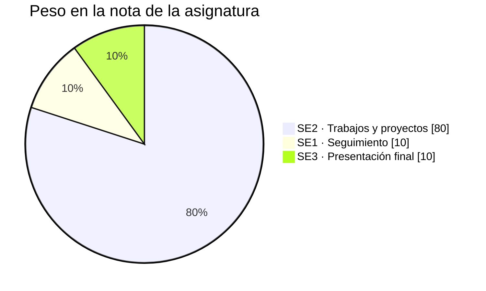
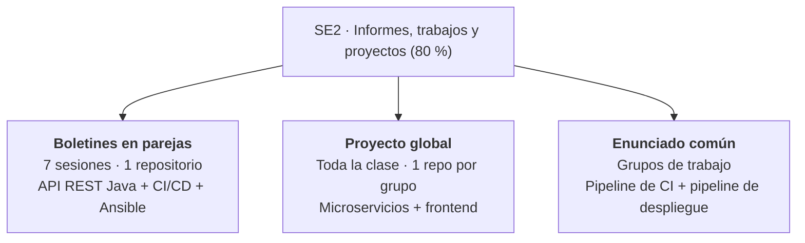
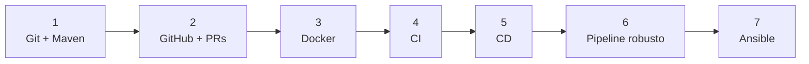
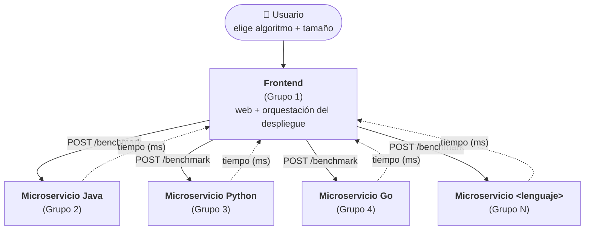
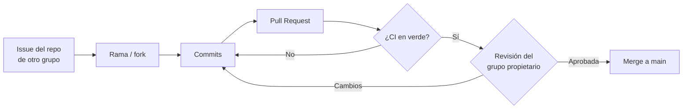
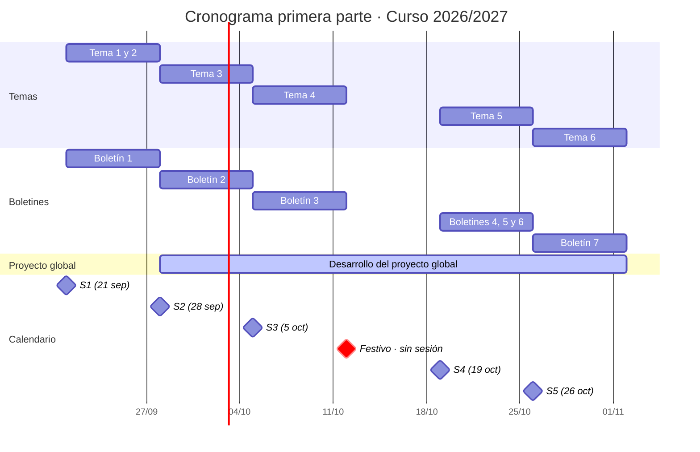

# Boletín 0 · Guía de la primera parte de la asignatura

> **Objetivo de este documento**
>
> Explicar **cómo se evalúa** la primera parte de la asignatura y **qué hay que entregar** en cada uno de sus tres bloques de trabajo: los *boletines en parejas*, el *proyecto global* y el *proyecto asociado al enunciado común*.

---

## Índice

1. [Sistema de evaluación](#1-sistema-de-evaluación)
2. [Boletines en parejas](#2-boletines-en-parejas)
3. [Proyecto global](#3-proyecto-global)
4. [Proyecto asociado al enunciado común](#4-proyecto-asociado-al-enunciado-común)
5. [Resumen de entregables](#5-resumen-de-entregables)
6. [Uso de asistentes de IA](#6-uso-de-asistentes-de-ia)
7. [Cronograma](#7-cronograma)

---

## 1. Sistema de evaluación

La asignatura tiene tres ítems evaluables:

| ID  | Denominación | Criterio | Peso |
|-----|--------------|----------|------|
| SE1 | Entrevistas virtuales de seguimiento de prácticas | Asistencia y participación | 10 % |
| SE2 | Evaluación de informes escritos, trabajos y proyectos | Boletines en parejas, proyecto global y proyecto del enunciado común | 80 % |
| SE3 | Evaluación de la presentación pública de trabajos | Entrevista / presentación final | 10 % |



El grueso de la nota (SE2) se reparte entre los tres bloques de trabajo que describe este documento:



---

## 2. Boletines en parejas

### 2.1. Qué se construye

A lo largo de **siete sesiones** se construye, de forma **incremental**, una **API REST en Java (Spring Boot)**: gestionada con Maven, contenerizada con Docker, validada por un pipeline de CI/CD en GitHub Actions y desplegada automáticamente con Ansible.

Cada boletín parte del resultado del anterior; no son ejercicios independientes.



### 2.2. Boletines

| Boletín | Tema |
|---|---|
| [1](boletin1-git-maven.html) | Git y proyecto Maven |
| [2](boletin2-github.html) | GitHub y colaboración con Pull Requests |
| [3](boletin3-docker.html) | Docker: contenerizar la aplicación |
| [4](boletin4-ci-github-actions.html) | Integración Continua con GitHub Actions |
| [5](boletin5-cd-github-actions.html) | Entrega Continua: construir, versionar y publicar la imagen |
| [6](boletin6-pipeline-robusto.html) | Pipeline robusto: calidad, seguridad y cadena de suministro |
| [7](boletin7-ansible.html) | Despliegue con Ansible |

### 2.3. Entrega

La entrega de esta parte es **un único repositorio de GitHub** que crece sesión a sesión. Debe contener una carpeta `docs/` con **un archivo Markdown por sesión**, llamado `boletinX.md` (donde `X` es el número de sesión):

```text
mi-repositorio/
├── docs/
│   ├── boletin1.md
│   ├── boletin2.md
│   └── ...
├── src/
├── pom.xml
├── Dockerfile
└── .github/workflows/
```

Cada `boletinX.md` debe incluir:

1. **Una tabla resumen de los commits** de esa sesión: mensaje, descripción breve de lo hecho, autor y enlace al commit en GitHub.
2. **Una explicación por commit**: qué se hizo y su relación con el boletín. Si se ha usado IA, indicar la herramienta y qué se le pidió.
3. **Capturas de pantalla** de aquellas partes del boletín que no queden reflejadas en los commits.

<details>
<summary><b>Plantilla sugerida para <code>docs/boletinX.md</code></b></summary>

```markdown
# Boletín X

## Resumen de commits

| # | Mensaje del commit | Qué se hizo | Autor | Enlace |
|---|--------------------|-------------|-------|--------|
| 1 | `feat: ...`        | ...         | ...   | [abc1234](https://github.com/.../commit/abc1234) |

## Detalle por commit

### 1. `feat: ...`
- **Qué se hizo:** ...
- **Autor:** ...
- **Relación con el boletín:** apartado X ...
- **Uso de IA:** herramienta y prompt utilizado (o "no se ha usado").

## Evidencias adicionales

<!-- Capturas de pantalla de lo que no queda reflejado en commits -->
```

</details>

---

## 3. Proyecto global

### 3.1. Objetivo

Toda la clase colabora en un mismo producto: una **página web** que, dado un **tamaño de entrada** y un **algoritmo clásico**, muestra el **tiempo de ejecución** de ese algoritmo en todos los lenguajes de programación soportados. La idea es disponer de un sistema que permita **comparar el rendimiento de algoritmos clásicos implementados en varios lenguajes**.

### 3.2. Arquitectura

La aplicación se organiza en microservicios: **un repositorio por grupo**, siguiendo la distribución de grupos del enunciado común.



**Regla de reparto:** con *N* grupos hay **1 frontend y *N* − 1 microservicios**, cada uno en un lenguaje distinto. Por ejemplo: 5 grupos → frontend + 4 microservicios; 6 grupos → frontend + 5 microservicios.

El repositorio del frontend es, además, el que **contiene la puesta en marcha de la aplicación completa** y, por tanto, depende en cierta medida de los demás.

### 3.3. Responsabilidades de cada grupo

Cada grupo es responsable de **preparar toda la infraestructura y el repositorio** de su microservicio.

| # | Grupo de una REST API | Grupo del frontend |
|---|---|---|
| 1 | REST API funcional en su lenguaje, con **un único algoritmo** implementado | Frontend funcional con **mocks** que imiten a los microservicios |
| 2 | Pipeline de **CI/CD**: testear, construir, versionar y publicar la imagen | Pipeline de **CI** con tests unitarios y, cuando existan los microservicios, tests de integración de la app completa |
| 3 | Conjunto de **issues** para que los resuelvan miembros de otros equipos (p. ej. un issue por algoritmo pendiente) | Conjunto de **issues** para otros equipos (aspectos estilísticos, funcionalidad adicional como gráficas, etc.) |
| 4 | `README.md` con instrucciones de uso y despliegue | `README.md` con instrucciones de uso y despliegue |
| 5 | `CONTRIBUTING.md` con instrucciones claras de cómo contribuir | `CONTRIBUTING.md` con instrucciones claras de cómo contribuir |

### 3.4. Contrato común de la API

Todas las REST APIs deben seguir **el mismo contrato de entrada y salida** para facilitar el trabajo del frontend: reciben un JSON con el tamaño de entrada y el algoritmo, y devuelven un JSON con el tiempo de ejecución.

> Ejemplo de contrato (a **consensuar entre todos los grupos** antes de empezar a implementar):

```jsonc
// POST /api/v1/benchmark
// Petición
{
  "algorithm": "mergesort",   // mergesort | quicksort | fibonacci | matmul
  "size": 10000
}
```

```jsonc
// Respuesta 200 OK
{
  "language": "java",
  "algorithm": "mergesort",
  "size": 10000,
  "timeMs": 12.34,            // mediana de las 5 mediciones
  "runs": 5
}
```

### 3.5. Algoritmos y protocolo de medición

En **todos** los casos se realizan **5 mediciones** y se toma la **mediana**.

| Algoritmo | Notas de medición |
|---|---|
| **MergeSort** | Las entradas se generan aleatoriamente |
| **QuickSort** | Las entradas se generan aleatoriamente |
| **Fibonacci** | Implementación con programación dinámica |
| **Multiplicación de matrices** | — |

### 3.6. Reglas de los repositorios

- **Push a `main` desactivado** (protección de rama).
- Cada PR debe tener **al menos un revisor** del grupo propietario del repositorio.
- Cada PR debe **pasar el pipeline de CI**; si no pasa, no se mergea.
- **Tests unitarios**: en los microservicios, cada algoritmo debe tener tests que verifiquen que funciona correctamente. En el frontend, tests que verifiquen la web contra *mocks* de los microservicios.
- **Tests de integración**: en las REST APIs, que los endpoints funcionan correctamente. En el frontend, que la web funciona con uno o varios microservicios reales.



### 3.7. Qué debe hacer cada estudiante

Para aprobar esta parte, **cada estudiante** debe:

- [ ] Realizar una **contribución no trivial** (que implique escribir código, no vale editar el `README`) **a cada microservicio que no sea el suyo**.
- [ ] Realizar una **revisión de código** de al menos un pull request **de su propio repositorio**.

---

## 4. Proyecto asociado al enunciado común

Los grupos de trabajo deben abordar **dos pipelines** relacionados con el MVP del proyecto común:

### 4.1. Pipeline de integración continua

Reflexionar sobre cómo aplicar al proyecto común las tecnologías de Prácticas Continuas vistas en la asignatura. Hay que **seleccionar herramientas concretas** e **instanciarlas** para automatizar parte del desarrollo de la aplicación.

### 4.2. Pipeline de despliegue (diseño)

Reflexionar sobre cómo aplicar al proyecto común las tecnologías de Cloud vistas en la asignatura. Hay que **justificar qué tecnologías se van a utilizar y cuáles no**, y explicar cómo se integrarían en un pipeline.

### 4.3. Entrega

Al finalizar la asignatura se entrega:

- Una **memoria** con los dos apartados anteriores **claramente diferenciados**.
- Un **enlace al repositorio público** con la implementación de dichos pipelines.

---

## 5. Resumen de entregables

| Bloque | Modalidad | Entregable |
|---|---|---|
| Boletines | Parejas | Un repositorio de GitHub con `docs/boletin1.md` … `docs/boletin7.md` |
| Proyecto global | Grupo (repo) + individual (contribuciones) | Repositorio del microservicio o frontend + contribuciones y revisiones de cada estudiante |
| Enunciado común | Grupo | Memoria (CI + despliegue) y repositorio público con los pipelines |

---

## 6. Uso de asistentes de IA

El uso de asistentes de IA (ChatGPT, Claude, Copilot, Gemini…) está **permitido y altamente recomendado** para generar cualquier artefacto software y documentación, con dos condiciones:

1. **Revisar siempre** lo generado antes de incorporarlo.
2. **Declarar el uso** en los boletines: qué herramienta se ha usado y qué se le ha pedido.

Se recomienda Claude Code, GitHub Copilot o Codex, con sus respectivas extensiones en VS Code.


## 7. Cronograma


