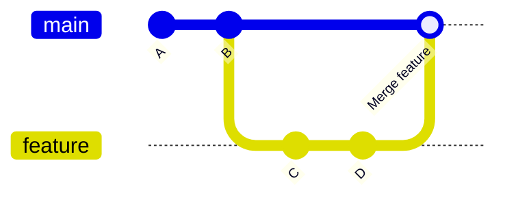
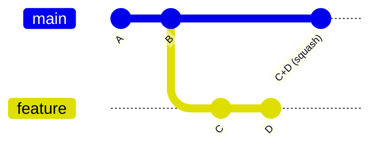
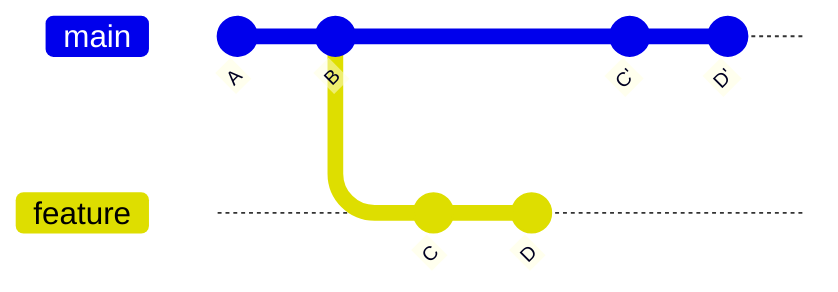
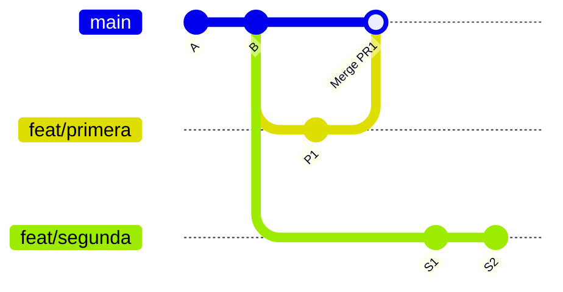
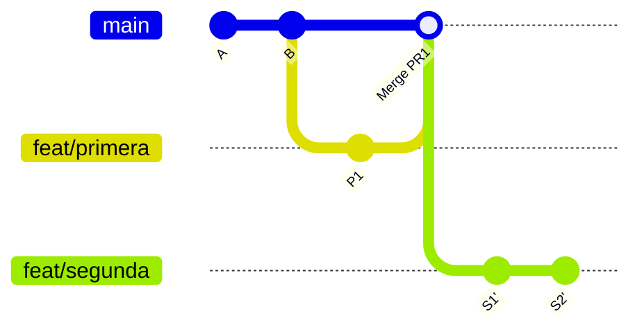
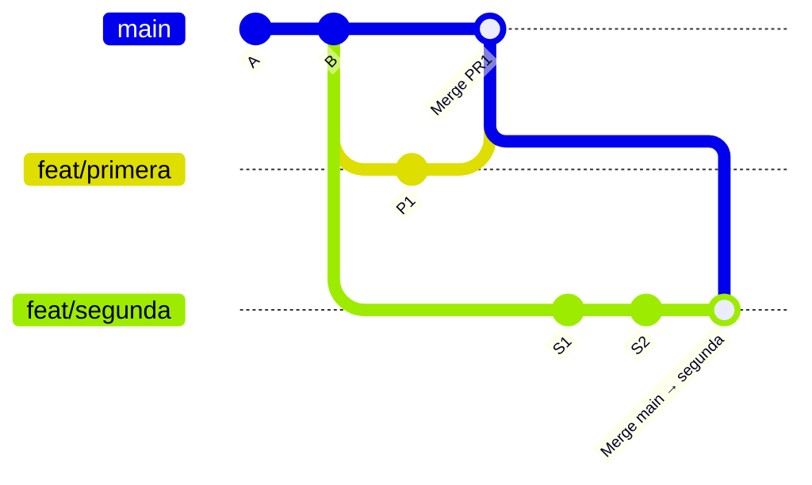

# Boletín 2: GitHub y colaboración con Pull Requests

> **OBJETIVO**
>
> Llevar tu proyecto a GitHub y trabajar con el flujo profesional de colaboración: ramas de feature, Pull Requests, revisión de código real entre compañeros, plantillas, propietarios de código y protección de la rama principal.

## 1. Objetivos de la sesión

- **Publicar el repositorio** en GitHub y entender la relación local ↔ remoto.
- **Dominar el flujo de Pull Requests** (GitHub Flow): rama → PR → revisión → merge.
- **Revisar el código de otra persona**.
- **Usar Issues, plantillas y CODEOWNERS** para organizar el trabajo.
- **Configurar branch protection** en `main` y elegir una política de merge.

## 2. Conceptos clave

### 2.1 Local frente a remoto

Tu repositorio local y el remoto (GitHub) son copias independientes que sincronizas explícitamente. Los comandos esenciales:

| Comando | Qué hace |
|---|---|
| git clone | Copia un repositorio remoto a tu máquina. |
| git push | Envía tus commits locales al remoto. |
| git fetch | Trae cambios del remoto SIN fusionarlos. |
| git pull | fetch + merge: trae y fusiona en un paso. |
| git pull --ff-only | Trae y solo avanza el puntero; si no puede, para y te avisa. |

> **CONSEJO**
>
> Configura `git config --global pull.ff only`. El `git pull` por defecto crea merge commits automáticos; con `--ff-only` Git te obliga a decidir conscientemente entre `merge` o `rebase`.

### 2.2 GitHub Flow

Es el flujo de colaboración más simple y el estándar de facto para equipos pequeños y proyectos modernos:

- `main` siempre debe estar desplegable (verde).
- Cada cambio se hace en una rama de feature corta.
- Al terminar, se abre un **Pull Request** para revisar el código antes de fusionar.
- Tras la aprobación (y los checks en verde), se fusiona a `main` y se borra la rama.


### 2.3 Cómo fusionar: merge, squash o rebase

GitHub ofrece tres botones, ninguno es "el correcto" y cada uno produce un historial distinto. Se suele elegir uno **y justificarlo**.

| Estrategia | Historial resultante | Cuándo tiene sentido |
|---|---|---|
| Merge commit | Conserva todos los commits de la rama y añade un commit de fusión. | Ramas largas donde el detalle intermedio aporta. |
| Squash and merge | Un único commit por PR en main. | Lo más habitual hoy: 1 PR = 1 cambio con significado. |
| Rebase and merge | Reaplica los commits en main, sin commit de fusión. | Historial lineal estricto, con commits ya bien redactados. |

Así queda `main` tras fusionar la misma rama (dos commits, `C` y `D`) con cada estrategia:

**Merge commit**



**Squash and merge**



**Rebase and merge**



Fíjate en `main`: con *merge* llegan los commits `C` y `D` tal cual, más un commit de fusión extra; con *squash* solo entra un commit nuevo que agrupa todo el cambio; con *rebase* entran `C'` y `D'` (el mismo contenido, reaplicado) en línea recta, sin bifurcación ni commit de fusión.


## 3. Trabajo práctico

### Parte A — Publicar el repositorio

- Crea un repositorio NUEVO y vacío en GitHub (sin README, para no generar conflictos).
- Conecta tu repo local con el remoto y haz el primer push:

```bash
git remote add origin https://github.com/TU_USUARIO/repo.git
git branch -M main
git push -u origin main
```

- Completa el `README.md`: descripción, requisitos, cómo construir, cómo arrancar y cómo activar los hooks del [Boletín 1](boletin1-git-maven.html).

### Parte B — Gobernanza del repositorio

Antes de abrir el primer PR, deja el repositorio preparado para que colaborar sea fácil:

- `.github/PULL_REQUEST_TEMPLATE.md`, [plantilla](https://docs.github.com/es/communities/using-templates-to-encourage-useful-issues-and-pull-requests/creating-a-pull-request-template-for-your-repository) que se cargará solo al abrir cada PR:

```
## Qué hace este PR

Closes #

## Cómo lo he probado

- [ ] Tests unitarios nuevos o actualizados
- [ ] Probado manualmente con curl / navegador

## Notas para quien revise

<!-- decisiones discutibles, alternativas descartadas, dudas -->
```

- Una [plantilla de Issue](https://docs.github.com/en/enterprise-cloud@latest/communities/using-templates-to-encourage-useful-issues-and-pull-requests/syntax-for-issue-forms?#converting-a-markdown-issue-template-to-a-yaml-issue-form-template) en `.github/ISSUE_TEMPLATE/feature.md` (y otra para `bug.md`).
- Un archivo `.github/CODEOWNERS` que asigne revisor automáticamente:

```bash
# Toda la aplicación la revisa el equipo
*               @tu_usuario @usuario_companero
```

Haz commit con lo anterior y haz push a `main`. 

### Parte C — Trabajo por Pull Requests

Realiza al menos **DOS** ciclos completos de PR, cada uno aportando una mejora real a la API (un endpoint nuevo, una validación, un filtro de búsqueda, paginación...).

**Ciclo de cada Pull Request:**

- Crea un Issue describiendo la mejora, con su etiqueta.
- Crea una rama de feature: `git switch -c feat/busqueda-por-estado`.
- Implementa el cambio (puedes usar la IA) y añade o ajusta los tests correspondientes.
- Sube la rama: `git push -u origin feat/busqueda-por-estado`.
- Abre el PR usando la plantilla. Enlaza el Issue con `Closes #N`.
- Recibe la revisión, responde a los comentarios (si los hay) y sube commits de corrección a la misma rama (si se considera necesario).
- Fusiona el PR con la estrategia que hayas elegido y borra la rama.

Uno crea el PR y el otro lo revisa. Cada integrante debe crear al menos un PR y revisar al menos uno del compañero.


### Parte D — Resolver el desfase de main

Es la situación que más se repite trabajando en equipo: abres tu rama, empiezas a trabajar, y mientras tanto se fusiona otro PR contra `main`. Tu rama sigue partiendo de un `main` antiguo, así que en cuanto intentes fusionar la tuya, GitHub avisará de un conflicto (o, si no hay conflicto de líneas, simplemente de que tu rama no está actualizada). Vas a reproducir esto a propósito:

- Crea dos ramas a partir del mismo `main` y que toquen la misma parte de un archivo.
- Fusiona la primera (no es necesario abrir un PR).
- La segunda rama se quedó desactualizada: `main` avanzó con el merge de la primera mientras tú seguías trabajando en la tuya. Antes de que tu PR pueda fusionarse limpio, tienes que traer ese avance a tu rama. Hazlo con un rebase en local, **no** con un merge. De este modo evitas meter un commit de fusión de `main` dentro de tu propia rama, que dejaría el historial menos limpio y podría romper un "Rebase and merge" posterior en GitHub:

```bash
git switch feat/segunda-rama
git fetch origin
git rebase origin/main
# Git se detiene en cada commit conflictivo (si lo hubiese): edita los archivos marcados,
git add <archivos-resueltos>
git rebase --continue
# repite hasta que el rebase termine, y sube la rama reescrita:
# --force-with-lease: "Sobrescribe la rama remota solo si nadie 
# la ha modificado desde la última vez que yo la vi."
git push --force-with-lease
```

Ilustremos con un ejemplo gráfico la diferencia entre rebase y merge en este caso:

**Antes del rebase** — `feat/segunda` sigue partiendo del `main` viejo, mientras `main` ya avanzó con el merge de `feat/primera`:



**Después del rebase** — `feat/segunda` reaplica sus commits (`S1'`, `S2'`) sobre la punta actual de `main`, que ya incluye `Merge PR1`:



`main` no se ha movido en ningún momento: quien se ha reescrito es `feat/segunda`.

**Y si en vez de rebase hicieras `git merge origin/main` estando en `feat/segunda`?** No hace falta que lo pruebes, pero fíjate en la diferencia: `S1` y `S2` mantienen su hash (nada se reescribe, no hace falta `--force-with-lease`), pero aparece un commit de fusión extra dentro de tu propia rama, y el historial deja de ser lineal:




### Parte E — Proteger la rama main

En **Settings → Branches** (o Rules → Rulesets), añade una regla de protección para `main`:

- Requiere Pull Request antes de fusionar, con **al menos 1 aprobación**.
- Prohíbe el push directo a `main` (**Require a pull request before merging**).
- **Require conversation resolution before merging**: no se fusiona con comentarios abiertos.
- **Dismiss stale approvals**: si el autor sube más commits, la aprobación caduca.
- Escribe un `CONTRIBUTING.md` que explique el flujo del proyecto a alguien que llega nuevo: Issue → rama → PR → revisión → merge. Incluye cómo poner tu rama al día con `git rebase origin/main` si `main` avanza mientras el PR sigue abierto, y documenta la política de merge elegida (squash, merge o rebase).
- En **Settings → General → Pull Requests**, deja marcada únicamente la casilla de la estrategia elegida (*Allow merge commits* / *Allow squash merging* / *Allow rebase merging*) para que GitHub no permita usar otra distinta al pulsar el botón de fusión.
- Comprueba que la protección funciona intentando saltártela:

```bash
git switch main
echo "prueba" >> README.md
git commit -am "chore: intento de push directo"
git push          # debe ser RECHAZADO por el servidor
```

> **CONSEJO**
>
> Deja activada esta protección: en el [Boletín 4](boletin4-ci-github-actions.html) le añadirás los **required status checks** para que un PR con tests rojos tampoco se pueda fusionar.

### Parte F — Nombres de rama

Un histórico con ramas como `prueba`, `cambios` o `asdf` no dice nada de lo que contienen. Adopta un prefijo que indique el tipo de cambio, antes del nombre descriptivo:

| Prefijo | Se usa para |
|---|---|
| `feat/` | Nueva funcionalidad |
| `fix/` | Corrección de un bug |
| `chore/` | Mantenimiento: dependencias, configuración, tareas sin efecto en el comportamiento |
| `docs/` | Cambios solo en documentación |

Ejemplos: `feat/busqueda-por-estado`, `fix/paginacion-vacia`, `docs/actualiza-readme`.

Investiga cómo hacer que esta convención sea obligatoria en tu repositorio con los Rulesets de GitHub.