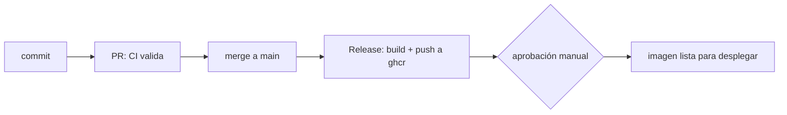

# Boletín 5: Entrega Continua: construir, versionar y publicar la imagen

> **OBJETIVO**
>
> Extender el pipeline para que, además de testear, construya la imagen Docker, la etiquete de forma trazable y la publique automáticamente en un registro (GitHub Container Registry). Al final, cada merge a main producirá una imagen versionada, y cada versión publicada pasará por una puerta de aprobación manual: eso es Entrega Continua de verdad.

## 1. Objetivos de la sesión

- **Distinguir CI, Continuous Delivery y Continuous Deployment**, y practicar la diferencia, no solo definirla.
- **Construir y publicar la imagen Docker** desde el pipeline hacia `ghcr.io`.
- **Versionar con SemVer**: etiquetas Git, releases y tags de imagen trazables.
- **Gestionar secretos, permisos y entornos** del pipeline de forma segura.

## 2. Conceptos clave

### 2.1 CI vs CD

| Término | Significado |
|---|---|
| Continuous Integration | Integrar y validar cada cambio automáticamente (lo del [Boletín 4](boletin4-ci-github-actions.html)). |
| Continuous Delivery | Dejar SIEMPRE un artefacto listo para desplegar, con un paso manual final de aprobación. |
| Continuous Deployment | Desplegar automáticamente a producción sin intervención humana. |

En este boletín llegamos hasta **Continuous Delivery**: publicamos automáticamente una imagen lista para desplegar y la promocionamos con una aprobación manual. El **Continuous Deployment** completo llega en el [Boletín 7](boletin7-ansible.html), cuando Ansible ponga esa imagen a correr en un servidor.

### 2.2 Versionado semántico y trazabilidad

Una imagen etiquetada solo como `latest` es un problema esperando a ocurrir: `latest` cambia bajo tus pies, así que "la versión que está desplegada" deja de ser una pregunta con respuesta. Cada imagen debe llevar al menos:

| Tag | Para qué sirve |
|---|---|
| sha-<commit> | Trazabilidad absoluta: de la imagen al commit exacto que la produjo. Inmutable. |
| 1.4.2 / 1.4 / 1 | Versión legible para las personas, según SemVer. |
| latest | Comodidad para probar en local. Nunca para desplegar. |

**SemVer** (`MAYOR.MENOR.PARCHE`): sube el parche al corregir un fallo, la menor al añadir funcionalidad compatible, y la mayor cuando rompes la compatibilidad de la API. Que tus commits sigan Conventional Commits ([Boletín 1](boletin1-git-maven.html)) hace que esta decisión sea casi automática.

### 2.3 El modelo de permisos del pipeline

GitHub Actions inyecta un token temporal, `GITHUB_TOKEN`, en cada ejecución. Por seguridad se debe conceder el **mínimo privilegio necesario** mediante el bloque `permissions`. Para publicar imágenes en `ghcr` necesitas permiso de escritura de `packages`.

## 3. Trabajo práctico — Núcleo (obligatorio)

### Parte A — Pipeline de publicación

Crea un nuevo workflow `.github/workflows/release.yml` que se ejecute al fusionar a `main` y también al publicar una etiqueta de versión:

```yaml
name: Release

on:
  push:
    branches: [ main ]
    tags: [ "v*.*.*" ]

permissions:
  contents: read
  packages: write

jobs:
  publish:
    runs-on: ubuntu-latest
    timeout-minutes: 20
    steps:
      - uses: actions/checkout@v4

      - name: Login en GHCR
        uses: docker/login-action@v3
        with:
          registry: ghcr.io
          username: ${{ github.actor }}
          password: ${{ secrets.GITHUB_TOKEN }}

      - name: Metadatos (tags)
        id: meta
        uses: docker/metadata-action@v5
        with:
          images: ghcr.io/${{ github.repository }}
          tags: |
            type=sha,prefix=sha-
            type=semver,pattern={{version}}
            type=semver,pattern={{major}}.{{minor}}
            type=raw,value=latest,enable={{is_default_branch}}

      - name: Construir y publicar
        uses: docker/build-push-action@v6
        with:
          context: .
          push: true
          tags: ${{ steps.meta.outputs.tags }}
          labels: ${{ steps.meta.outputs.labels }}
          cache-from: type=gha
          cache-to: type=gha,mode=max
```

- Fusiona un PR a `main` y observa el workflow **Release** en la pestaña Actions.
- Comprueba que la imagen aparece en la pestaña **Packages** del repositorio, etiquetada con el SHA del commit y con `latest`.
- Mide el tiempo de la primera build y el de la segunda: la caché `type=gha` debería reducirlo notablemente.

### Parte B — Publicar una versión de verdad

- Crea una etiqueta anotada y súbela:

```bash
git tag -a v1.0.0 -m "Primera versión publicable de la API de tareas"
git push origin v1.0.0
```

- Comprueba que el workflow se dispara de nuevo y que la imagen aparece ahora también como `1.0.0`, `1.0` y `1`.
- Crea la **Release** en GitHub a partir de esa etiqueta, con notas describiendo los cambios (puedes usar "Generate release notes").
- Repite el ciclo con un `v1.0.1` tras un `fix` y con un `v1.1.0` tras un `feat`, justificando en las notas por qué ese número y no otro.

### Parte C — Verificar la imagen publicada

- Descarga y ejecuta tu imagen recién publicada desde el registro, **por su tag inmutable**:

```bash
docker pull ghcr.io/TU_USUARIO/tareas-api:1.0.0
docker run -p 8080:8080 ghcr.io/TU_USUARIO/tareas-api:1.0.0

curl http://localhost:8080/actuator/health   # debe responder UP
```

> **CONSEJO**
>
> Si el package se crea como privado, puedes hacerlo público desde su configuración para probar el pull sin autenticarte; recuerda que un pull autenticado (`docker login ghcr.io`) también es válido como evidencia.

### Parte D — La puerta manual: entornos con aprobación

Esto es lo que convierte el pipeline en Entrega Continua y no en un simple publicador. Crea un **environment** llamado `produccion` en `Settings → Environments` con un *required reviewer* (tú mismo o tu pareja), y añade un job de promoción que dependa de él:

```yaml
  promote:
    needs: publish
    runs-on: ubuntu-latest
    environment: produccion        # aquí el workflow se DETIENE y espera aprobación
    steps:
      - name: Marcar la versión como aprobada para despliegue
        run: |
          echo "Versión aprobada: ${{ needs.publish.outputs.version }}"
          echo "Lista para el despliegue del Boletín 7."
```

- Lanza el workflow y observa cómo el job queda **en espera** hasta que alguien pulse "Review deployments → Approve".
- Guarda una captura del estado pendiente y del historial de despliegues del entorno.
- Explica en el `AI_LOG.md` en qué se diferencia ahora tu pipeline de un Continuous Deployment.

### Parte E — Secretos y configuración

Tu app necesita configuración sensible (credenciales de BD, claves de API) en ejecución. Aprende a no hardcodearla:

- Crea un **secret** en `Settings → Secrets and variables → Actions` y consúmelo con `${{ secrets.NOMBRE }}`.
- Crea también una **variable** (no secreta) y consúmela con `${{ vars.NOMBRE }}`. Explica en el README cuándo usar cada una.
- Verifica que tu `docker-compose.yml` y tu aplicación leen la configuración desde **variables de entorno**, no desde valores fijos en el código.
- Comprueba el enmascarado: haz `echo` de un secret en un step y observa que GitHub lo sustituye por `***` en el log. Después intenta imprimirlo en base64 y comprueba que **ya no se enmascara**: los secretos no son un mecanismo de seguridad frente a quien controla el workflow.

> **OJO**
>
> Revisa todo el historial: si en algún momento subiste una contraseña real al repositorio, **considérala comprometida**. Borrarla del archivo no la borra del historial. Lo primero es rotar la credencial; después, limpiar el historial con `git filter-repo`. Las credenciales de los ejemplos deben ser ficticias y solo de desarrollo.

### Parte F — Documentar el flujo

Actualiza el README con un diagrama (Mermaid renderiza directamente en GitHub) del flujo completo:

````

````

- Explica qué tags se generan, cuál usarías para desplegar y por qué **no** sería `latest`.

## 4. Ampliación (para nota alta)

### Parte G — Imágenes multiarquitectura

Si tu pareja tiene un Mac con Apple Silicon y tú un PC, vuestra imagen no sirve para los dos. Publica para ambas arquitecturas:

```yaml
      - uses: docker/setup-qemu-action@v3
      - uses: docker/setup-buildx-action@v3
      - uses: docker/build-push-action@v6
        with:
          platforms: linux/amd64,linux/arm64
          push: true
          tags: ${{ steps.meta.outputs.tags }}
```

- Comprueba con `docker manifest inspect` que la imagen contiene ambas variantes y mide cuánto ha crecido el tiempo de build.

### Parte H — Procedencia y SBOM

- Genera el **SBOM** (inventario de todo lo que hay dentro de la imagen) y la **atestación de procedencia**, que prueba criptográficamente qué workflow y qué commit la construyeron:

```yaml
        with:
          sbom: true
          provenance: mode=max
# y, como job aparte:
      - uses: actions/attest-build-provenance@v1
        with:
          subject-name: ghcr.io/${{ github.repository }}
          subject-digest: ${{ steps.build.outputs.digest }}
          push-to-registry: true
```

- Verifica la atestación con `gh attestation verify` y explica qué ataque previene exactamente.

### Parte I — Changelog automático

- Configura `.github/release.yml` para agrupar las notas por etiquetas de PR, o usa `release-drafter` para que el borrador de la próxima versión se mantenga solo.
- Comprueba que tus Conventional Commits del [Boletín 1](boletin1-git-maven.html) hacen que el changelog salga legible sin retocarlo.

## 5. Cierre de la sesión

### Reto de depuración

- **`denied: permission_denied` al hacer push a ghcr.** El workflow tiene `permissions: contents: read` y nada más. Explica el error exacto y arréglalo con el mínimo privilegio, no dando permisos totales.
- **La imagen se publica pero no arranca en otra máquina**: `exec format error`. ¿Qué ha pasado y cómo se relaciona con la Parte G?
- **Dos merges seguidos a `main` producen dos imágenes `latest` distintas** y el compañero que hizo `docker pull` hace diez minutos tiene otra cosa. Explica por qué esto es exactamente el argumento contra desplegar por `latest`.

### Antes de terminar

- Actualiza `docs/AI_LOG.md` con al menos dos entradas.
- Checkpoint: sabrás explicar qué es `GITHUB_TOKEN`, por qué un tag `sha-` es inmutable y qué diferencia hay entre Delivery y Deployment en **tu** pipeline concreto.

## 6. Entrega del boletín

> **ENTREGA**
>
> El repositorio en GitHub, con:

- `release.yml` que construye y publica la imagen en `ghcr.io` al fusionar a `main` y al etiquetar una versión.
- Al menos **tres versiones publicadas** (`v1.0.0`, `v1.0.1`, `v1.1.0`) con sus Releases y notas, más las imágenes correspondientes en Packages etiquetadas por SHA, versión y `latest`.
- Evidencia de que una imagen publicada **se descarga por su tag de versión y arranca** (`/actuator/health` en UP).
- Entorno `produccion` con aprobación manual y captura del job en espera.
- Bloque `permissions` de mínimo privilegio y uso correcto de secrets y variables.
- README con el flujo CI/CD documentado y diagrama.
- `docs/AI_LOG.md` actualizado.

## 7. Criterios de evaluación

| Aspecto | Peso |
|---|---|
| Publicación automática de la imagen en ghcr al hacer merge y al etiquetar | 25% |
| Versionado SemVer: tags Git, Releases con notas y tags de imagen trazables | 20% |
| Entorno con aprobación manual funcionando (Entrega Continua real) | 15% |
| La imagen se descarga por tag inmutable y arranca correctamente | 15% |
| Permisos mínimos y gestión correcta de secretos y variables | 10% |
| Documentación del flujo en el README | 5% |
| Diario de IA (docs/AI_LOG.md) con reflexión real | 10% |
| Bonus — Ampliación: multiarquitectura, SBOM y procedencia, changelog automático | hasta +1,5 |
