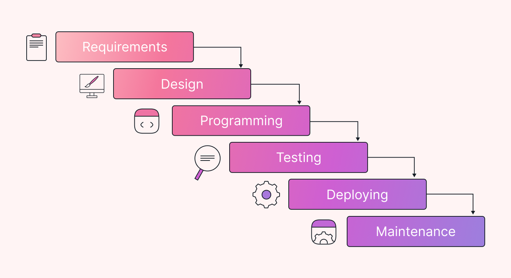
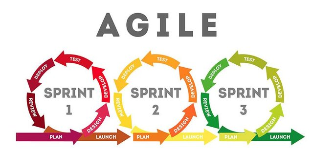
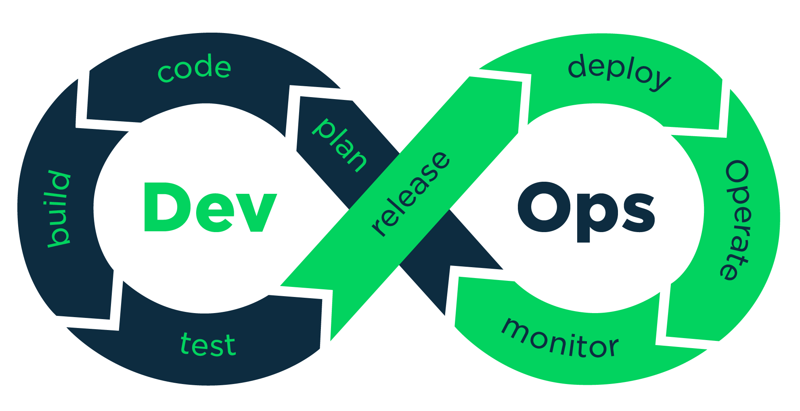
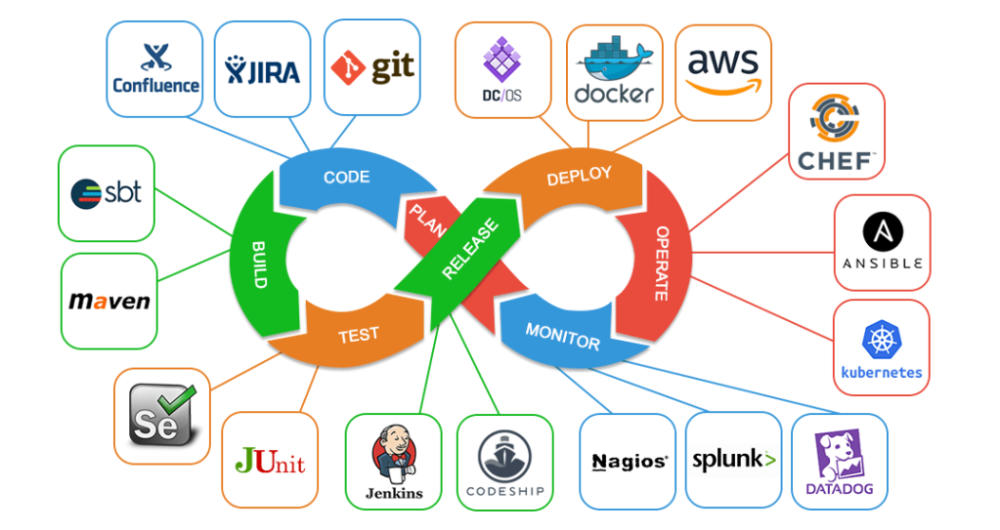

<!-- _class: lead -->
<!-- _paginate: false -->
<!-- _footer: "" -->

# Tema 1
## Fundamentos de las Prácticas Continuas y DevOps

Grado en Informática · Universidad de Murcia

---

## Índice

1. Motivación: del modelo en cascada a DevOps
2. ¿Qué es DevOps?
3. Fases de un ciclo DevOps
4. Prácticas continuas: CI, CD e IaC (panorama general)
5. DevOps extendido y DevSecOps

---

<!-- _class: divider -->

# 1. Motivación

---

## El modelo en cascada

El **modelo en cascada** tradicional organiza el desarrollo software como un *pipeline* rígido y lineal:

**requisitos → diseño → desarrollo → testing → despliegue → mantenimiento**

Cada fase termina por completo antes de empezar la siguiente.

---

## Problemas del modelo en cascada

- **Cambios costosos** una vez se avanza de fase: volver atrás implica rehacer trabajo ya dado por cerrado.
- **El feedback llega tarde**: el cliente solo ve el producto completo al final, en la fase de despliegue.
- Cualquier error de requisitos o diseño se detecta cuando ya es caro corregirlo.

---

## Ejemplo: app de citas médicas (I)

Desarrollo con modelo cascada:

- **Requisitos (enero)**: documento de 50 páginas, se da por cerrado.
- **Diseño (febrero-marzo)**: se diseña toda la arquitectura (pantallas + BD + APIs).
- **Desarrollo (abril-julio)**: 4 meses de implementación sin mostrar nada al cliente.

---

## Ejemplo: app de citas médicas (II)

- **Pruebas (agosto)**: los testers descubren que...
  - las pantallas son demasiado complejas para usuarios mayores → **volver a requisitos**
  - la concurrencia de citas cuelga el sistema → **volver a diseño**
- **Despliegue (septiembre... o más tarde)**: el cliente no acepta la entrega.
  - Reabrir requisitos y rediseñar → **retraso mínimo de 3-4 meses**, con un coste altísimo porque ya está todo construido.

---

## Modelos iterativos / en espiral

Usan fases similares, pero la aplicación se construye en **iteraciones** que añaden funcionalidad poco a poco:

**diseño → desarrollo → testing → demo al cliente** (y vuelta a empezar)

---

## Problemas del modelo iterativo

Normalmente hay dos equipos: **desarrollo** (diseño, código, testing) y **operaciones** (despliegue, monitorización).

- **El despliegue es manual y doloroso**: copiar artefactos, ejecutar scripts, configurar servidores a mano.
- **Operaciones recibe "grandes paquetes de cambios" infrecuentemente** → cada despliegue es más arriesgado y laborioso.
- **Los entornos de pruebas no coinciden con producción**: se crean y mantienen a mano, desincronizados → "funciona en pruebas pero no en producción".

---

## El problema de fondo

> **Escasa automatización y limitada comunicación y coordinación entre los equipos de desarrollo y operaciones.**

Esta es exactamente la brecha que DevOps busca cerrar.

---

<!-- _class: divider -->

# 2. ¿Qué es DevOps?

---

## Definición

DevOps nace de las prácticas iterativas, por la necesidad de mayor sinergia entre desarrollo y operaciones.

> **DevOps** es un esfuerzo colaborativo y multidisciplinario dentro de una organización para **automatizar** la entrega continua de nuevas versiones de software, garantizando su corrección y confiabilidad.

---

## Aspectos clave de DevOps

- **Cultura de la colaboración**
  - Mentalidad que fomenta la colaboración, la responsabilidad compartida y la mejora continua entre desarrollo y operaciones.
- **Automatización**
  - Automatización de cada fase del ciclo de vida.
  - Integración Continua y Entrega/Despliegue Continuo (**CI/CD**).
  - Infraestructura como código (**IaC**).

---

## Fases de un ciclo DevOps

**Plan → Code → Build → Test → Release → Deploy → Operate → Monitor** → (vuelta a Plan)

---

## Detalle de las fases (I)

- **Plan**: se definen requisitos, funcionalidades y prioridades del producto.
- **Code**: los desarrolladores implementan el código usando repositorios colaborativos (Git, etc.).
- **Build**: el código se compila, se generan artefactos y se realiza integración continua.
- **Test**: se ejecutan pruebas automáticas (unitarias, de integración, etc.).

---

## Detalle de las fases (II)

- **Release**: se prepara el artefacto probado para su despliegue (pasando por *staging* si procede).
- **Deploy**: se automatiza el paso a producción mediante *pipelines* CI/CD e infraestructura como código.
- **Operate**: el sistema se mantiene en ejecución: disponibilidad, rendimiento, seguridad.
- **Monitor**: se recogen métricas, logs y feedback para detectar fallos y oportunidades de mejora.
- **Loop continuo**: los datos de monitorización retroalimentan la planificación, cerrando el ciclo.

---

## Automatización de las fases

Existen multitud de herramientas que dan soporte a cada fase del ciclo DevOps:

A lo largo de la asignatura usaremos: **Git, Maven, GitHub, Docker, GitHub Actions y Ansible**.

---

<!-- _class: divider -->

# 3. Prácticas continuas: panorama general

---

## Integración, Entrega y Despliegue Continuos

| Práctica | ¿Qué automatiza? | ¿Llega a producción? |
|---|---|---|
| **Integración continua (CI)** | Compilación + tests al hacer commit | ❌ No |
| **Entrega continua (CD)** | CI + empaquetado (+ despliegue a *staging*) | Lista para producción (manual) |
| **Despliegue continuo** | Entrega continua + despliegue automático | ✅ Automáticamente |

Se estudiarán en detalle en el **Tema 5**, con GitHub Actions como herramienta principal.

---

## Infraestructura como código (IaC)

> **IaC** es un enfoque que consiste en definir, aprovisionar y gestionar la infraestructura (servidores, redes, bases de datos...) mediante archivos de código, en lugar de configurarla manualmente.

- Se escriben scripts o archivos declarativos (Terraform, Ansible, CloudFormation...) que describen la infraestructura deseada.
- Esos archivos se **versionan como cualquier código**: reproducibilidad, control de cambios, colaboración.

Se estudiará en detalle en el **Tema 6**, con Ansible como herramienta principal.

---

## Cómo DevOps resuelve los problemas tradicionales

| Problema tradicional | ¿Cómo lo resuelve DevOps? |
|---|---|
| Despliegue manual y doloroso | Pipelines CI/CD repetibles; pasar a producción es automático o "un clic" |
| Operaciones recibe grandes paquetes de cambios | Despliegues frecuentes y pequeños → bajo riesgo por entrega |
| Entornos de pruebas ≠ producción | IaC genera entornos consistentes desde la misma definición |

---

<!-- _class: divider -->

# 4. DevOps extendido

---

## Ampliando el pipeline

Se trata de ampliar las fases habituales de un *pipeline* DevOps, enriqueciendo las existentes o añadiendo nuevas etapas.

Ejemplos:

- Añadir **analizadores estáticos** para comprobar que el código es legible y sigue buenas prácticas (entre compilación y tests).
- **DevSecOps**: añadir etapas que comprueban la seguridad de la aplicación en código, build, test y deploy.

⚠️ Añadir más fases de comprobación tiene un coste: los **falsos positivos** pueden bloquear todo el *pipeline*.

---

## DevSecOps

> **DevSecOps** = Desarrollo + Seguridad + Operaciones. Integra prácticas de seguridad de forma continua y automatizada en el flujo de desarrollo y despliegue, en vez de tratarlas como un añadido final.

Prácticas habituales:

- **SAST** (Static Application Security Testing): analiza el código fuente en busca de vulnerabilidades.
- **DAST** (Dynamic Application Security Testing): pruebas de seguridad durante la ejecución.
- **SCA** (Software Composition Analysis): detecta vulnerabilidades en librerías y dependencias.
- **IaC scanning**: valida plantillas de Terraform, Ansible, Kubernetes...
- **Escaneo de imágenes** Docker con herramientas como Trivy o Clair.

---

<!-- _class: lead -->
<!-- _paginate: false -->
<!-- _footer: "" -->

# ¿Y ahora qué?

La asignatura recorre el ciclo DevOps completo:

**Tema 2**: control de versiones y build tools · **Tema 3**: colaboración en GitHub
**Tema 4**: contenedorización · **Tema 5**: CI/CD · **Tema 6**: IaC con Ansible
