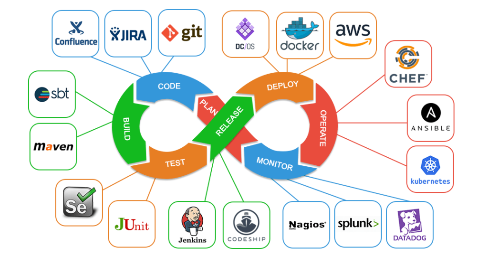

<!-- _class: lead -->
<!-- _paginate: false -->
<!-- _footer: "" -->

# Tema 1
## Fundamentos de las Prácticas Continuas y DevOps

MISUM · Universidad de Murcia

---

## Índice

1. Motivación y concepto de DevOps
2. Fases de DevOps y el símbolo del infinito
3. Automatización: prácticas continuas e infraestructura como código
4. DevOps extendido y DevSecOps

---

## Motivación

**El problema del pasado:**
- Lanzamientos de software cada varios meses, grandes y arriesgados 
- Corregir un bug detectado tarde costaba mucho más tiempo y dinero
- Dev y Ops trabajaban aislados, problema de "en mi máquina funciona"
- Un fallo en producción se convertía en "juego de culpas"

**Lo que las empresas necesitaban:**
- Entregar valor al usuario más rápido y con menos riesgo
- Detectar errores antes de que lleguen a producción
- Equipos que colaboren en vez de culparse

> DevOps nace como respuesta a estos problemas.

---

## ¿Qué es DevOps?

> Unión de **Desarrollo (Dev)** y **Operaciones (Ops)** en un solo flujo de trabajo continuo.

**Antes:** Dev escribía código → lo "lanzaba por encima del muro" → Ops lo desplegaba
**Resultado:** culpas cruzadas, entregas lentas, poca comunicación

**Pilares de DevOps:**
- Colaboración y responsabilidad compartida
- Automatización
- Medición y monitoreo constante
- Iteración rápida (cambios pequeños y frecuentes)

---

## Las fases DevOps y el símbolo del infinito

> Representa que DevOps no es lineal: es un ciclo de mejora continua. Se divide en dos mitades: Dev y Ops.

---

## Detalle de las fases

### 🛠️ Dev
**Plan → Code → Build → Test**

- **Plan**: definir qué se construye
- **Code**: escribir el código
- **Build**: compilar/empaquetar 
- **Test**: pruebas automáticas

### 🚀 Ops
**Release → Deploy → Operate → Monitor**

- **Release**: preparar la versión 
- **Deploy**: desplegar a producción 
- **Operate**: mantener el sistema funcionando
- **Monitor**: observar métricas, logs, errores

---

## Herramientas

Existen multitud de herramientas que dan soporte a cada fase del ciclo DevOps:

A lo largo de la asignatura usaremos: **Git, Maven, GitHub, Docker, GitHub Actions y Ansible**.

---

## Automatización

> Uno de los pilares de DevOps es la **automatización**.

Formas principales de automatizar:
- Prácticas continuas (CI/CD)
- Infraestructura como código (IaC)
---

## Prácticas continuas (CI/CD)

- Se implementan mediante **pipelines** que automatizan la compilación, pruebas y despliegue de software

| Práctica | ¿Qué automatiza? | ¿Llega a producción? |
|---|---|---|
| **Integración continua (CI)** | Compilación + tests  | ❌ No |
| **Entrega continua (CD)** | CI + empaquetado  | Lista para producción (manual) |
| **Despliegue continuo** | Entrega continua + despliegue automático | ✅ Automáticamente |

- Las pipelines se estudiarán en detalle en el **Tema 5** con GH Actions

---

## Infraestructura como código (IaC)

> **IaC** es un enfoque que consiste en definir, aprovisionar y gestionar la infraestructura (servidores, redes, bases de datos...) mediante archivos de código, en lugar de configurarla manualmente.

- Se escriben scripts o archivos declarativos (Terraform, Ansible, CloudFormation...) que describen la infraestructura deseada.
- Esos archivos se **versionan como cualquier código**: reproducibilidad, control de cambios, colaboración.

Se estudiará en detalle en el **Tema 6**, con Ansible como herramienta principal. En la segunda parte de la asignatura también veréis otras tecnologías.

---

## DevOps extendido: ampliando el pipeline

> DevOps extendido: se trata de ampliar las fases habituales de un *pipeline* DevOps, enriqueciendo las existentes o añadiendo nuevas etapas.

Ejemplos:

- Añadir **analizadores estáticos** para comprobar que el código es legible y sigue buenas prácticas (entre compilación y tests).
- **DevSecOps**: añadir etapas que comprueban la seguridad de la aplicación en código, build, test y deploy.

⚠️ Añadir más fases de comprobación tiene un coste: los **falsos positivos** pueden bloquear todo el *pipeline*.

---

## DevSecOps

> **DevSecOps** = Desarrollo + Seguridad + Operaciones. Integra prácticas de seguridad de forma continua y automatizada en el flujo de desarrollo y despliegue, en vez de tratarlas como un añadido final.

- **SAST** (Static Application Security Testing): analiza el código fuente en busca de vulnerabilidades.
- **DAST** (Dynamic Application Security Testing): pruebas de seguridad durante la ejecución.
- **SCA** (Software Composition Analysis): detecta vulnerabilidades en librerías y dependencias.
- **IaC scanning**: valida plantillas de Terraform, Ansible, Kubernetes...
- **Escaneo de imágenes** Docker con herramientas como Trivy o Clair.

---

<!-- _class: lead -->
<!-- _paginate: false -->
<!-- _footer: "" -->

# ¿Y ahora qué?

- Tema 2: control de versiones y build tools 
- Tema 3: colaboración en GitHub
- Tema 4: contenedorización
- Tema 5: CI/CD
- Tema 6: IaC con Ansible
