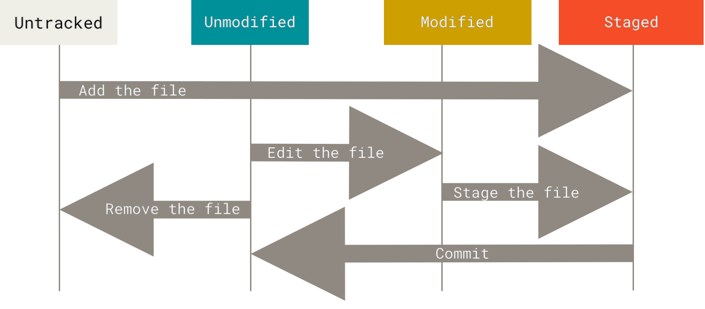

<!-- _class: lead -->
<!-- _paginate: false -->
<!-- _footer: "" -->

# Tema 2
## Control de versiones y herramientas de construcción

MISUM · Universidad de Murcia

---

## Índice

1. Sistemas de control de versiones
2. Git: conceptos y comandos básicos
3. Ramas y fusión de cambios
4. Herramientas de construcción (*build tools*)
5. Maven

---

<!-- _class: divider -->

# 1. Sistemas de control de versiones

---

## ¿Qué es un VCS?

> Un **sistema de control de versiones** (VCS, *Version Control System*) es una herramienta que permite registrar, gestionar y coordinar los cambios en archivos (normalmente código fuente) a lo largo del tiempo.

Son fundamentales en el desarrollo de software colaborativo. Existen dos tipos:

- Sistemas de control de versiones **centralizados**
- Sistemas de control de versiones **distribuidos**

El más utilizado, con diferencia, es **Git**, que es distribuido.

---

## VCS centralizados

- Surgen para facilitar el trabajo colaborativo (antes: `archivo.py`, `archivo_final.py`, `archivo_super_final.py`...).
- Existe un **único repositorio central** (servidor) que almacena todo el historial. Los desarrolladores actúan como clientes: descargan (*checkout*), modifican en su copia local y suben sus cambios (*commit*) al servidor.
- Ejemplo típico: **Subversion** (SVN), hoy casi en desuso.
- Problemas: punto único de fallo, poca flexibilidad para ramas y fusiones, requieren conexión permanente.

---

## VCS distribuidos

- Cada desarrollador tiene **una copia completa del repositorio** (código + historial + ramas). No dependen de un único servidor para operar.
- **Operaciones locales** (no requieren red): commit, branch, merge, diff, log.
- **Sincronización**: intercambio de cambios mediante *push*/*pull*/*fetch* entre repositorios.
- **Flujos flexibles**: no existe un "servidor único obligatorio"; puede haber varios remotos.
- El sistema más famoso y usado: **Git**.

---

<!-- _class: divider -->

# 2. Git

---

## Un poco de historia

- Creador: **Linus Torvalds** (el creador de Linux), en 2005.
- El núcleo Linux usaba un sistema propietario (BitKeeper). Al retirarse la licencia gratuita, Linus desarrolló Git en pocas semanas.
- Hoy es el VCS estándar de la industria.

---

## Las tres zonas de un repositorio local

- **Working Directory**: archivos "vivos" en tu carpeta. Si no hay cambios, coincide con el último commit.
- **Staging Area** (*índice*): zona intermedia donde preparas los cambios que irán en el próximo commit.
- **Local Repository** (`.git`): historial completo con todas las versiones confirmadas.

---

## Estados de un archivo

Cada archivo puede estar en uno de estos estados:

- **Untracked**: no está siendo seguido por Git (nuevo, sin `git add`).
- **Unmodified**: trackeado y sin cambios desde el último commit.
- **Modified**: modificado desde el último commit.
- **Staged**: los cambios están preparados (`git add`) para el próximo commit.

<center>



</center>

---

## ¿Qué pasa al hacer `git commit`?

1. Git toma lo que está en el *staging area* (lo añadido con `git add`).
2. Guarda una "foto" completa del proyecto en ese momento en `.git`.
3. Crea un objeto **commit** con: la foto de los archivos, la referencia al commit anterior, autor, fecha, mensaje y un **hash** único (ID).
4. Actualiza la rama actual para que apunte a este nuevo commit.
5. Limpia el *staging area*.

---

## Crear un repositorio

Dos opciones:

- `git init` (dentro de la carpeta del proyecto): crea el directorio `.git` que almacenará el historial y la configuración.
- `git clone <url>`: clona un repositorio remoto en un directorio local, descargando todo su contenido e historial.

---

## Comandos básicos de Git

| Comando | Descripción |
|---|---|
| `git clone url [dir]` | Copiar un repositorio remoto |
| `git add file` | Añadir el contenido del archivo al *staging area* |
| `git commit -m "msg"` | Registrar una instantánea del *staging area* |
| `git status` | Ver el estado del directorio de trabajo y el *staging area* |
| `git diff` | Ver diferencias entre lo modificado y lo preparado |
| `git log` | Ver el historial de commits |
| `git pull` / `git push` | Sincronizar con un repositorio remoto |

---

## Confirmar y deshacer cambios

- Añadir al *staging area*: `git add <archivo>` (o `git add -A` para todos).
- Confirmar cambios en *staged*: `git commit -m "arreglado bug #23"`.
- Sacar un archivo del *staging area*: `git restore --staged <archivo>`.
- Descartar cambios en el *working directory*: `git restore <archivo>`.

---

## Ver y analizar cambios

- Estado del directorio de trabajo y del *staging area*: `git status`
- Ver lo modificado sin preparar: `git diff`
- Ver lo ya preparado: `git diff --cached`
- Ver el historial de commits: `git log`

---

<!-- _class: divider -->

# 3. Ramas y fusión de cambios

---

## Ramificación (*branching*)

Se usa mucho para trabajar en paralelo sobre diferentes líneas de desarrollo.

- Crear una rama local: `git branch <nombre>`
- Listar las ramas locales: `git branch`
- Cambiar de rama: `git switch <nombre>`

Trabajar en una rama aislada evita interferir con el trabajo de otros hasta que los cambios estén listos.

---

## Fusión (*merge*)

`git merge` une los cambios de dos ramas, integrando sus historiales:

```bash
git switch main
git merge <nombre_rama>
```

Al fusionar puede pasar una de estas tres cosas:

- `main` no tiene commits nuevos → **fast-forward** (mueve el puntero, sin commit nuevo).
- `main` tiene commits nuevos y no hay conflicto → se crea un **nuevo commit de merge**.
- `main` tiene commits nuevos y hay conflicto → el merge **se interrumpe** hasta resolverlo.

---

## Conflictos de *merge*

Cuando alguien ha tocado la misma parte del archivo en la rama principal:

- El *merge* se interrumpe; Git **no crea ningún commit todavía**.
- Los archivos en conflicto quedan marcados:

```
<<<<<<< HEAD
líneas que están en la rama actual (p.ej. main)
=======
líneas que vienen de la rama que se está fusionando
>>>>>>> feature
```

Tras editar y resolver: `git add <archivo>` y `git commit -m "fusionado"`.

---

## Interacción con el repositorio remoto

- `git push origin <rama>`: envía los commits locales al remoto.
- `git pull origin <rama>`: obtiene los cambios más recientes. Equivale a:

```bash
git fetch origin <rama>
git merge origin/<rama>
```

El flujo de colaboración completo con ramas remotas y *Pull Requests* se estudia en el **Tema 3**.

---

<!-- _class: divider -->

# 4. Herramientas de construcción

---

## ¿Qué es un *build tool*?

> Una **herramienta de construcción** (*build tool*) automatiza el proceso de convertir código fuente en un artefacto ejecutable: compilar, gestionar dependencias, ejecutar tests y empaquetar la aplicación.

Sin una build tool, cada desarrollador compilaría "a mano" y de forma distinta → resultados inconsistentes, difíciles de reproducir y de integrar en pipelines CI/CD.

Ejemplos según lenguaje: **Maven**/**Gradle** (Java), **npm** (JavaScript), **pip**/**poetry** (Python), **Cargo** (Rust)...

---

## ¿Por qué son clave en DevOps?

- **Reproducibilidad**: el mismo comando construye lo mismo en cualquier máquina (tu portátil, un compañero, un *runner* de CI).
- **Gestión de dependencias**: declaran qué librerías necesita el proyecto y en qué versión, y las descargan automáticamente.
- **Automatización**: un único comando (`mvn package`, `npm run build`...) sustituye pasos manuales.
- **Integración con CI/CD**: los pipelines invocan directamente a la build tool (lo veremos en el Tema 5).

---

<!-- _class: divider -->

# 5. Maven

---

## ¿Qué es Maven?

> **Maven** es una herramienta de construcción y gestión de proyectos para el ecosistema Java, mantenida por la Apache Software Foundation.

- Convención sobre configuración: estructura de carpetas estándar (`src/main/java`, `src/test/java`...).
- Gestiona **dependencias** descargándolas de repositorios remotos (Maven Central).
- Define un **ciclo de vida** de construcción reproducible.
- Es extensible mediante **plugins**.

---

## El fichero `pom.xml`

El **POM** (*Project Object Model*) describe el proyecto: identidad, dependencias, plugins, configuración de build.

```xml
<project>
  <groupId>com.example</groupId>
  <artifactId>mi-app</artifactId>
  <version>1.0.0</version>
  <packaging>jar</packaging>

  <dependencies>
    <dependency>
      <groupId>org.junit.jupiter</groupId>
      <artifactId>junit-jupiter</artifactId>
      <version>5.10.0</version>
      <scope>test</scope>
    </dependency>
  </dependencies>
</project>
```

---

## El ciclo de vida de Maven

Maven define **fases** ordenadas; ejecutar una fase ejecuta también todas las anteriores:

| Fase | ¿Qué hace? |
|---|---|
| `validate` | Comprueba que el proyecto es correcto |
| `compile` | Compila el código fuente |
| `test` | Ejecuta los tests unitarios |
| `package` | Empaqueta el código compilado (`.jar`, `.war`...) |
| `verify` | Ejecuta comprobaciones sobre el paquete generado |
| `install` | Instala el paquete en el repositorio local (`~/.m2`) |
| `deploy` | Publica el paquete en un repositorio remoto |

---

## Comandos habituales

```bash
mvn compile        # compila el código fuente
mvn test           # ejecuta compile + los tests
mvn package        # genera el .jar/.war en target/
mvn clean          # borra los artefactos generados (carpeta target/)
mvn clean install  # limpia, construye, testea e instala en ~/.m2
```

Estos son exactamente los comandos que automatizaremos en un *pipeline* de **Integración Continua** en el Tema 5.

---

## Dependencias y repositorios

- Cada `<dependency>` del POM se identifica por `groupId:artifactId:version` (**coordenadas Maven**).
- Maven busca primero en el **repositorio local** (`~/.m2/repository`); si no está, la descarga de un **repositorio remoto** (por defecto, Maven Central).
- El `scope` de una dependencia determina cuándo está disponible:
  - `compile` (por defecto): disponible siempre.
  - `test`: solo para compilar y ejecutar tests.
  - `provided`: la aporta el entorno de ejecución (p. ej. un servidor de aplicaciones).

---

## Plugins de Maven

- Maven en sí mismo hace poco: casi todo el trabajo (compilar, testear, empaquetar) lo realizan **plugins**.
- Se configuran dentro de `<build><plugins>` en el POM.
- Ejemplos:
  - `maven-compiler-plugin`: controla la versión de Java usada al compilar.
  - `maven-surefire-plugin`: ejecuta los tests unitarios en la fase `test`.
  - `maven-jar-plugin` / `maven-war-plugin`: controla cómo se empaqueta el artefacto.

---

<!-- _class: lead -->
<!-- _paginate: false -->
<!-- _footer: "" -->

# Resumen

Git nos da un historial versionado y reproducible del código.
Maven nos da una construcción reproducible del artefacto.

Ambos son la base sobre la que se construyen los *pipelines* CI/CD (Tema 5).

👉 **Práctica 1: Git y Maven**
