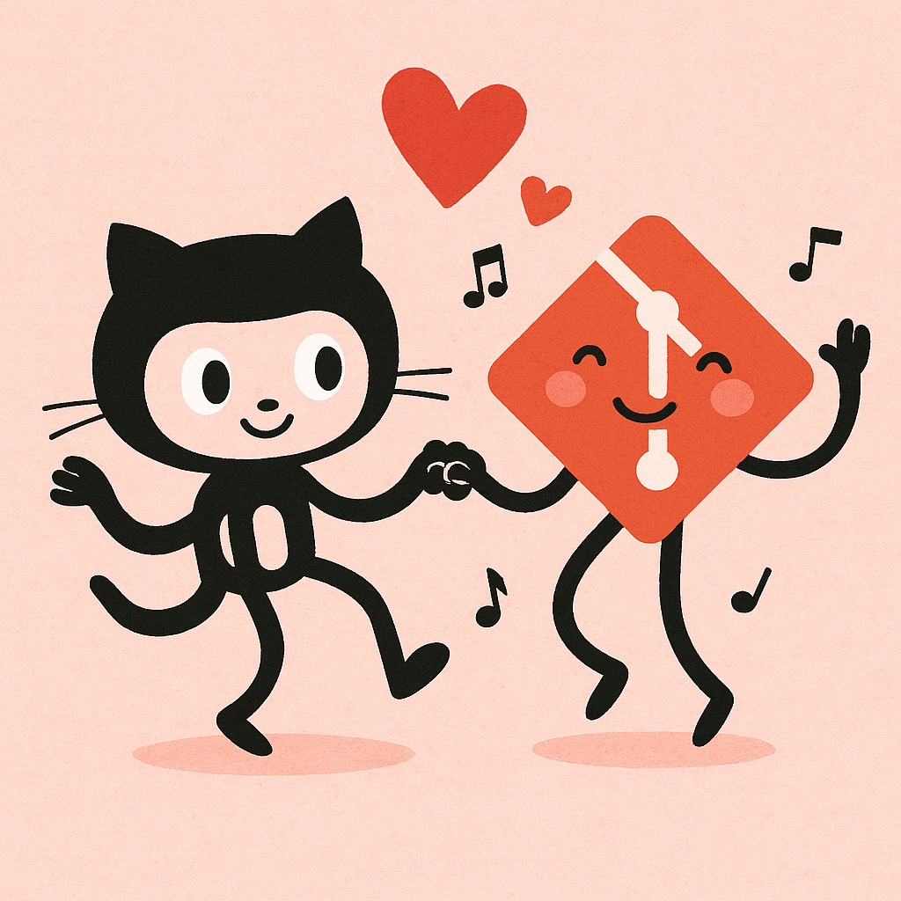
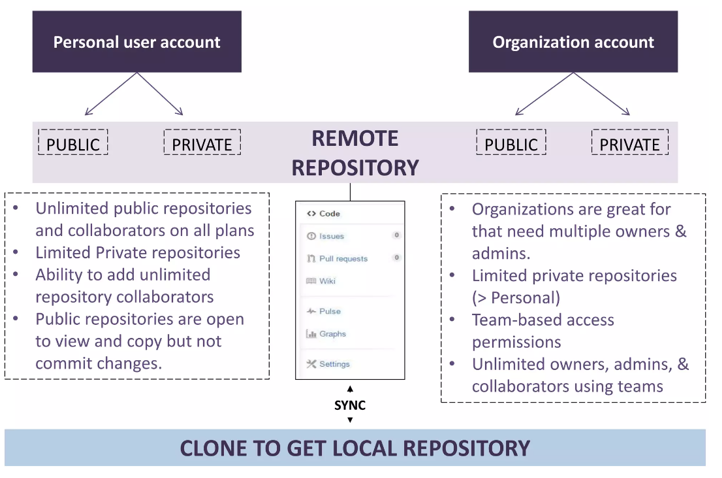
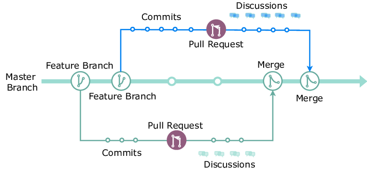

<!-- _class: lead -->
<!-- _paginate: false -->
<!-- _footer: "" -->

# Tema 3
## Colaboración y flujos de trabajo sobre repositorios

Grado en Informática · Universidad de Murcia

---

## Índice

1. GitHub: qué es y para qué sirve
2. Colaboración en GitHub: ramas, *Pull Requests*, *issues*, *forks*
3. El flujo de trabajo con *feature branches*
4. Buenas prácticas de *Pull Request* y revisión de código

---

<!-- _class: divider -->

# 1. GitHub

---

## ¿Qué es GitHub?

> **GitHub** es una plataforma en línea (propiedad de Microsoft) que aloja repositorios Git en la nube y facilita la colaboración entre desarrolladores.

- Añade una interfaz web, gestión de *issues*, revisión de código, CI/CD (**GitHub Actions**), wikis, etc.
- **No es un sistema de control de versiones en sí mismo**: usa Git como base y añade servicios extra.

---

## Git vs GitHub

- **Git** = la herramienta de control de versiones.
- **GitHub** = la plataforma donde subes tus repositorios Git para compartirlos o colaborar.

 

- Puedes usar Git **sin** GitHub.
- No puedes usar GitHub **sin** Git (es su base técnica).
- En Git, el repositorio vive en tu máquina local. En GitHub, vive en un servidor remoto.

---

## Estructura de un repositorio en GitHub

Código, *issues*, *pull requests*, *actions*, *wiki* y ajustes conviven en el mismo repositorio.

---

<!-- _class: divider -->

# 2. Colaboración en GitHub

---

## GitHub no es solo "guardar código"

Es una plataforma diseñada para la colaboración entre desarrolladores, tanto en proyectos privados como abiertos:

- **Repositorios remotos compartidos**: cada colaborador clona el repo, trabaja en local con Git y sincroniza con GitHub.
- **Ramas y *Pull Requests***: cada colaborador desarrolla en su propia rama y propone integrar sus cambios.
- **Issues**: registran errores, tareas pendientes o ideas.
- **Forks**: la base de la colaboración *open-source*.

---

## Branches y Pull Requests

- Cada colaborador crea una **rama** (*branch*) para desarrollar una nueva funcionalidad sin afectar a `main`.
- Cuando los cambios están listos, se abre un **Pull Request (PR)** desde esa rama hacia la rama principal.
- Un PR permite:
  - Revisar el código entre compañeros (*code review*).
  - Discutir mejoras o dudas mediante comentarios, línea a línea.
  - Ejecutar comprobaciones automáticas (tests, linters) antes de fusionar.

---

## Issues

- Permiten registrar **errores** (*bugs*), **tareas pendientes** o **solicitudes de mejora**.
- Se pueden asignar a personas, etiquetar (`bug`, `enhancement`, `good first issue`...) y agrupar en *milestones*/proyectos.
- Un *commit* o *PR* puede **cerrar automáticamente** un issue si su mensaje incluye `Closes #12` o `Fixes #12`.

---

## Forks

- Cualquier usuario puede **"forkear"** un repositorio público: crea su propia copia completa en su cuenta.
- Puede hacer cambios libremente en su *fork* sin afectar al proyecto original.
- Cuando quiere contribuir, abre un **Pull Request desde su fork** hacia el repositorio original.
- Es la base de la colaboración en proyectos *open-source*, donde no todo el mundo tiene permiso de escritura directo.

---

## Flujo de trabajo en GitHub

Ejemplo real: `https://github.com/jgrapht/jgrapht/pull/811`

---

<!-- _class: divider -->

# 3. El flujo de trabajo con *feature branches*

---

## GitHub Flow (paso a paso)

1. **Actualizar `main`**: `git switch main && git pull`.
2. **Crear una rama** con un nombre descriptivo: `git switch -c feature/login-form`.
3. **Trabajar y confirmar cambios** en commits pequeños y con mensajes claros.
4. **Subir la rama**: `git push -u origin feature/login-form`.
5. **Abrir un Pull Request** hacia `main`, describiendo qué hace y por qué.
6. **Revisión de código**: compañeros comentan, piden cambios o aprueban.
7. **Fusionar el PR** (normalmente con *squash* o *merge commit*) y **borrar la rama**.

---

## ¿Por qué ramas cortas y frecuentes?

- Cuanto más tiempo vive una rama sin fusionarse, **más diverge** de `main` → más riesgo de conflictos.
- Ramas pequeñas y PRs enfocados en **un solo cambio** son más fáciles y rápidos de revisar.
- Facilita la integración continua: cada PR dispara los checks de CI (Tema 5) sobre un cambio acotado.

 

> Regla práctica: si tu PR tiene más de ~400 líneas de diff, probablemente deberías dividirlo.

---

## Estrategias de fusión de un PR

| Estrategia | Qué hace | Cuándo usarla |
|---|---|---|
| **Merge commit** | Conserva todos los commits de la rama + crea un commit de fusión | Se quiere preservar el historial detallado |
| **Squash and merge** | Aplasta todos los commits de la rama en **uno solo** sobre `main` | Historial de `main` limpio, un commit por funcionalidad |
| **Rebase and merge** | Reaplica los commits de la rama sobre `main`, sin commit de fusión | Historial lineal, sin merges "de más" |

---

## Protección de ramas

GitHub permite configurar reglas sobre `main` (*branch protection rules*):

- Exigir que el PR **pase los checks de CI** antes de poder fusionarse.
- Exigir **al menos una aprobación** de revisión antes de fusionar.
- Prohibir el *push* directo a `main`: todo cambio pasa por PR.
- Exigir que la rama esté **actualizada** con `main` antes de fusionar.

Esto convierte las buenas prácticas en **reglas automáticas**, no solo en confianza.

---

<!-- _class: divider -->

# 4. Buenas prácticas de PR y *code review*

---

## Al abrir un Pull Request

- **Título claro** que resuma el cambio (a veces se usa *Conventional Commits*: `fix: ...`, `feat: ...`).
- **Descripción** con: qué problema resuelve, cómo se ha resuelto, cómo probarlo.
- Enlazar el *issue* relacionado (`Closes #42`).
- Mantenerlo **pequeño y enfocado** en un único propósito.
- Asegurarse de que **pasa la CI** antes de pedir revisión.

---

## Al revisar el código de otra persona

- Revisar **el problema, no a la persona**: comentarios sobre el código, en tono constructivo.
- Distinguir entre observaciones **bloqueantes** ("esto rompe X") y **sugerencias** ("podría simplificarse así").
- Comprobar: ¿es correcto?, ¿tiene tests?, ¿es legible?, ¿sigue las convenciones del proyecto?
- Aprobar (`Approve`), pedir cambios (`Request changes`) o solo comentar (`Comment`).

---

## Al recibir comentarios de revisión

- No tomarlo como algo personal: el objetivo es mejorar el código compartido.
- Responder a cada comentario (aunque sea para decir "hecho" o justificar por qué no se aplica).
- Volver a solicitar revisión tras aplicar los cambios (`Re-request review`).

 

> El *code review* es, junto con la CI, la principal red de seguridad antes de que un cambio llegue a `main`.

---

<!-- _class: lead -->
<!-- _paginate: false -->
<!-- _footer: "" -->

# Resumen

GitHub añade colaboración (ramas, PRs, issues, forks) sobre Git.
El flujo de *feature branches* + *code review* + CI es el estándar profesional.

👉 **Práctica 2: GitHub**
