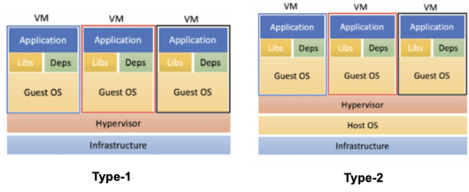
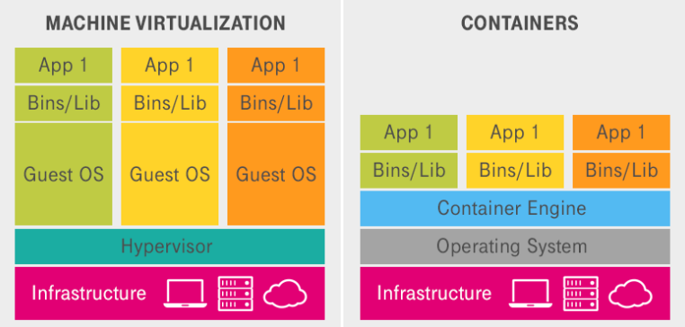
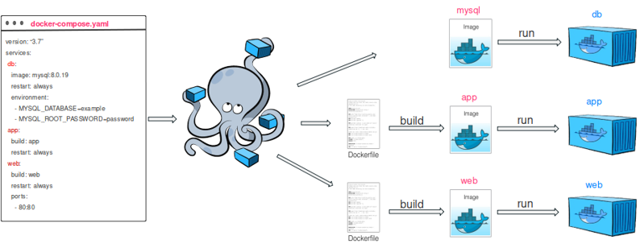

<!-- _class: lead -->
<!-- _paginate: false -->
<!-- _footer: "" -->

# Tema 4
## Virtualización y contenedorización

MISUM · Universidad de Murcia

---

## Índice

1. Virtualización: concepto y tipos
2. Contenedores vs máquinas virtuales
3. Docker: arquitectura y componentes
4. Imágenes y Dockerfile
5. Redes y volúmenes en Docker
6. Docker Compose

---

<!-- _class: divider -->

# 1. Virtualización

---

## ¿Qué es la virtualización?

> **Virtualización** es una tecnología que crea versiones virtuales de recursos computacionales (servidores, redes, almacenamiento...), permitiendo que múltiples instancias lógicas se ejecuten sobre una única máquina física.

Tipos principales:

- **Virtualización de hardware** (máquinas virtuales)
- **Virtualización de sistema operativo** (contenedores)
- Virtualización de redes, de almacenamiento...

---

## Virtualización de hardware

> Crea una o más **máquinas virtuales (MV)** en un servidor físico abstrayendo sus recursos de hardware (CPU, memoria, almacenamiento, red).

- Cada MV se comporta como un ordenador real: sistema operativo propio, aplicaciones y hardware virtual.
- Un **hipervisor** actúa como capa entre el hardware físico y las máquinas virtuales.
- Es la base del *cloud computing*.
- Ejemplos: Xen, KVM, VirtualBox, VMware, Hyper-V.

<center>



</center>

---

## Conceptos clave

- **Host**: servidor o máquina física donde se ejecuta la virtualización.
- **Guest**: la máquina virtual que se ejecuta dentro del host.
- **Hipervisor**: software que reserva recursos y asegura el aislamiento entre *guests*.

---

<!-- _class: divider -->

# 2. Contenedores vs máquinas virtuales

---

## Virtualización de sistema operativo

> Permite que múltiples entornos de espacio de usuario aislados (**contenedores**) se ejecuten sobre un único **kernel** del sistema operativo.

Un contenedor es un **proceso aislado** que incluye todo lo necesario para ejecutarse: código, dependencias y configuración.

<center>



</center>

---

## Comparativa

| | Contenedores | Máquinas virtuales |
|---|---|---|
| **Kernel** | Comparten el del host | SO completo, con su propio kernel |
| **Arranque** | Muy rápido (segundos) | Lento (como arrancar un PC) |
| **Aislamiento** | Menor (comparten kernel) | Mayor (aislamiento total) |
| **Flexibilidad** | Debe encajar con el kernel del host | Cualquier SO |
| **Recursos** | Proceso + librerías (ligero) | RAM + CPU + SO completo (pesado) |

La tecnología de contenedores más usada es **Docker**.

---

## Virtualización y DevOps

DevOps necesita entornos **consistentes** en desarrollo, pruebas y producción:

- **Máquinas virtuales**: aislamiento robusto para probar diferentes plataformas.
- **Contenedores**: mismo kernel del host, espacio de usuario aislado → entornos ligeros y reproducibles.

> Ambos enfoques ayudan a resolver el clásico problema de **"en mi máquina funcionaba"**.

---

<!-- _class: divider -->

# 3. Docker

---

## ¿Qué es Docker?

> **Docker** es una plataforma de código abierto que permite crear, empaquetar y ejecutar aplicaciones en entornos aislados llamados **contenedores**.

- Usa **namespaces** de Linux para aislar recursos: cada contenedor tiene su propio árbol de procesos, red y sistema de ficheros.
- Usa **cgroups** para limitar recursos (CPU, RAM, disco) entre contenedores.
- Todo corre sobre un **único kernel Linux compartido**.
- En Windows/Mac, Docker Desktop gestiona automáticamente una pequeña MV Linux en segundo plano.

---

## Componentes principales de Docker

- **Docker client**: interfaz con la que interactúa el usuario; habla con el *daemon* vía la API REST de Docker.
- **Docker engine** = *daemon* + API:
  - *Daemon*: proceso en segundo plano que construye imágenes, arranca/detiene contenedores, gestiona redes y volúmenes.
  - *API*: interfaz REST para que clientes y herramientas hablen con el *daemon*.
- **Docker image**: plantilla inmutable (sistema de archivos + metadatos + instrucciones de construcción).
- **Docker container**: instancia en ejecución de una imagen.
- **Docker Hub**: registro público de imágenes.

---

## ¿Qué pasa al ejecutar `docker run`?

```bash
docker run -d -p 8080:80 nginx
```

1. El **cliente** envía la orden al **daemon** vía la API (socket Unix o TCP).
2. El *daemon* comprueba si la imagen `nginx` está disponible localmente; si no, la descarga de **Docker Hub**.
3. Crea el contenedor: monta las capas de la imagen, configura *namespaces* y un *cgroup*, y el mapeo de puertos (8080 → 80).
4. Lanza el proceso principal (`nginx`) dentro de ese entorno aislado.
5. Las peticiones a `localhost:8080` se redirigen al puerto 80 del contenedor.

---

## Comandos del cliente Docker

```bash
docker pull <imagen>          # descargar una imagen del Hub
docker build -t <tag> .       # construir una imagen a partir de un Dockerfile
docker run <imagen>           # arrancar un contenedor a partir de una imagen
docker start/stop <id>        # arrancar/parar un contenedor existente
docker ps                     # listar contenedores en ejecución
docker network ...            # gestionar redes
docker volume ...             # gestionar volúmenes
```

---

<!-- _class: divider -->

# 4. Imágenes y Dockerfile

---

## Docker images

> Las **imágenes** son plantillas inmutables a partir de las cuales se crean los contenedores: un *snapshot* con todo lo necesario para ejecutar una aplicación.

Se construyen a partir de un **Dockerfile** y están formadas por un conjunto de **capas cacheables**:

```dockerfile
FROM python:3.12-slim                  # Capa 1
WORKDIR /app                           # Capa 2
COPY . .                               # Capa 3
RUN pip install -r requirements.txt    # Capa 4
```

---

## El Dockerfile

> Un **Dockerfile** es un archivo de texto con instrucciones que Docker usa para construir automáticamente una imagen: una receta paso a paso para un entorno reproducible.

```dockerfile
FROM python:3.12-slim
WORKDIR /app
COPY . .
RUN pip install --no-cache-dir -r requirements.txt
EXPOSE 8000
CMD ["python", "app.py"]
```

```bash
docker build -t miapp:1.0 .
docker run --rm -p 8000:8000 miapp:1.0
```

---

## Instrucciones más comunes

- **FROM**: imagen base (Ubuntu, Python, Alpine...).
- **WORKDIR**: directorio de trabajo dentro de la imagen.
- **COPY / ADD**: copian archivos del host al contenedor.
- **RUN**: ejecuta comandos durante la construcción (p. ej. instalar paquetes).
- **ENV**: define variables de entorno.
- **EXPOSE**: documenta el puerto que usará el contenedor.
- **CMD**: comando por defecto al arrancar (puede sobrescribirse).
- **ENTRYPOINT**: comando que se ejecuta siempre.
- **ARG**: parámetros pasables con `--build-arg`.

---

## Docker Hub

> **Docker Hub** (`hub.docker.com`) es un servicio en línea para almacenar, compartir y descargar imágenes Docker.

- Miles de imágenes oficiales y de la comunidad: `docker pull nginx`, `docker pull postgres:16`...
- Cada imagen se identifica como `<usuario>/<repositorio>:<tag>` (o `<repositorio>:<tag>` si es oficial).
- Se pueden subir imágenes propias para usarlas en *pipelines* CI/CD:

```bash
docker login
docker tag miapp:1.0 miusuario/miapp:1.0
docker push miusuario/miapp:1.0
```

---

<!-- _class: divider -->

# 5. Redes y volúmenes

---

## Docker Network

Cada contenedor se ejecuta en su propio *namespace* de red, con una interfaz virtual (`eth0`) aislada del resto. Al lanzarlo, se asocia a una red concreta:

- **bridge** (por defecto): los contenedores en la misma red se ven entre sí por IP; el exterior solo accede si se expone un puerto (`-p`).
- **bridge personalizada**: igual que la anterior, pero además con **DNS entre contenedores** (`ping web` funciona).
- **host**: el contenedor comparte la red del host directamente (sin aislamiento, sin necesidad de `-p`).
- **none**: sin acceso a red; útil para aislamiento extremo.

---

## Ejemplo: red bridge personalizada

```bash
docker network create mi_red
docker run -d --name db --network mi_red postgres
docker run -d --name web --network mi_red miapp:1.0
```

Desde el contenedor `web`, `ping db` funciona gracias al DNS interno de la red personalizada.

---

## Docker Volumes

> Los **volúmenes** son el mecanismo recomendado para persistir datos generados por los contenedores, ya que el sistema de archivos de un contenedor es **efímero** (se borra al eliminarlo).

```bash
docker volume create datos_mysql

docker run -d --name mi_mysql \
  -e MYSQL_ROOT_PASSWORD=1234 \
  -v datos_mysql:/var/lib/mysql \
  mysql:8
```

Los volúmenes se gestionan por Docker, pueden compartirse entre contenedores y son ideales para bases de datos.

---

## Bind mounts

> Un **bind mount** conecta directamente una carpeta o archivo del host a un directorio del contenedor: los cambios se reflejan al instante en ambos lados.

```bash
docker run -d --name mi_mysql_bind \
  -e MYSQL_ROOT_PASSWORD=1234 \
  -v /home/usuario/mysql_datos:/var/lib/mysql \
  mysql:8
```

Muy usado para compartir código fuente entre el host y el contenedor durante el desarrollo.

---

<!-- _class: divider -->

# 6. Docker Compose

---

## ¿Qué es Docker Compose?

> **Docker Compose** es una herramienta oficial que permite definir y ejecutar aplicaciones **multicontenedor** con un único archivo YAML (`docker-compose.yml`).

En vez de lanzar varios `docker run` con opciones largas, describes toda la aplicación (servicios, redes, volúmenes, variables) en un solo fichero:

```bash
docker compose up
```

<center>



</center>

Muchos ejemplos en: `github.com/docker/awesome-compose`

---

## Ejemplo de `docker-compose.yml`

```yaml
services:
  web:
    build: .
    ports:
      - "8000:8000"
    depends_on:
      - db
  db:
    image: postgres:16
    environment:
      POSTGRES_PASSWORD: 1234
    volumes:
      - datos_db:/var/lib/postgresql/data

volumes:
  datos_db:
```

Un único `docker compose up` construye `web`, levanta `db` y los conecta en una red común.

---

<!-- _class: lead -->
<!-- _paginate: false -->
<!-- _footer: "" -->

# Resumen

Docker empaqueta la aplicación y sus dependencias en contenedores reproducibles.
Docker Compose orquesta aplicaciones multicontenedor con un solo fichero.

👉 **Práctica 3: Docker**
