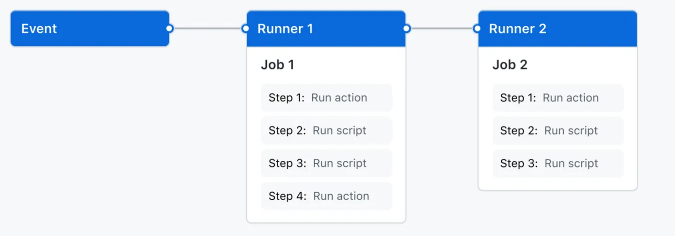

<!-- _class: lead -->
<!-- _paginate: false -->
<!-- _footer: "" -->

# Tema 5
## Integración y Entrega Continuas

Grado en Informática · Universidad de Murcia

---

## Índice

1. Pipelines CI/CD
2. GitHub Actions: conceptos y sintaxis
3. Integración Continua con GitHub Actions
4. Entrega Continua con GitHub Actions
5. Estrategias de despliegue
6. Otras herramientas y pipelines extendidos

---

<!-- _class: divider -->

# 1. Pipelines CI/CD

---

## ¿Qué es una pipeline CI/CD?

> Una **pipeline CI/CD** es una secuencia automatizada de etapas que permite construir, probar y entregar software de forma continua, rápida y fiable.

| Práctica | ¿Qué automatiza? | ¿Llega a producción? |
|---|---|---|
| **Integración continua** | Compilación + tests al hacer commit | ❌ No |
| **Entrega continua** | CI + empaquetado (+ despliegue a *staging*) | Lista para producción (manual) |
| **Despliegue continuo** | Entrega continua + despliegue automático | ✅ Automáticamente |

---

## Etapas típicas de Integración Continua

1. **Detección de cambios**: disparada por un `push` o un `pull request`.
2. **Checkout** del código: clonar la rama correspondiente.
3. **Compilación / build**: generar binarios o artefactos (p. ej. `mvn compile`).
4. **Ejecución de tests automáticos**: unitarios, de integración, *linting*.
5. **Informe de resultados**: éxito o fallo, con *feedback* rápido al equipo.

---

## Etapas adicionales de Entrega Continua

A lo anterior se añade:

- **Empaquetado** del software: `.jar`, imagen Docker, `.zip`...
- **Tests adicionales**: de integración, aceptación, *end-to-end*.
- **Publicación en un repositorio intermedio**: Docker Hub, Artifactory...
- **Despliegue en *staging*/preproducción** para validación manual o QA.
- **Aprobación manual opcional** antes de pasar a producción.

El **despliegue continuo** añade, además, el despliegue automático a producción, verificación post-despliegue y *rollback* automático si algo falla.

---

<!-- _class: divider -->

# 2. GitHub Actions

---

## ¿Qué es GitHub Actions?

> **GitHub Actions** es una plataforma de integración y entrega continuas integrada en GitHub que permite automatizar el flujo de compilación, prueba y despliegue.

- Los *workflows* pueden construir y probar cada *pull request*, o desplegar cambios fusionados a producción.
- Va más allá de CI/CD: puede reaccionar a cualquier evento del repositorio (p. ej. etiquetar un *issue* al crearse).
- Ofrece máquinas virtuales Linux, Windows y macOS (*runners*) para ejecutar los *workflows*.

---

## Componentes principales

- Un **workflow** se activa cuando ocurre un **evento** del repositorio (`push`, `pull_request`, `schedule`...).
- Un workflow contiene uno o más **jobs**, que pueden ejecutarse en secuencia o en paralelo.
- Cada **job** se ejecuta en su propia máquina virtual (**runner**) y consta de uno o más **steps**.
- Cada **step** es una **action** (reutilizable) o un **script**.



---

## Anatomía de un workflow

Los *workflows* se definen en YAML dentro de `.github/workflows/`:

```yaml
# .github/workflows/ci.yml
name: CI

on:
  push:
    branches: ["main"]
  pull_request:
    branches: ["main"]

jobs:
  build:
    runs-on: ubuntu-latest
    steps:
      - uses: actions/checkout@v4
      - uses: actions/setup-java@v4
        with:
          java-version: "17"
          distribution: "temurin"
      - run: mvn -B clean verify
```

---

<!-- _class: divider -->

# 3. Integración Continua con GitHub Actions

---

## Un workflow de CI, paso a paso

Retomando el ejemplo anterior:

- Se ejecuta al recibir un `push` a `main` o al abrir un `pull request` contra `main`.
- Contiene un job (`build`) con tres *steps*:
  1. `actions/checkout@v4`: acción predefinida que clona el repositorio.
  2. `actions/setup-java@v4`: instala el JDK indicado en el *runner*.
  3. `mvn -B clean verify`: compila el proyecto y ejecuta los tests.
- Si cualquier *step* falla, el job (y el workflow) se marca en **rojo** y GitHub lo muestra en el PR.

---

## *Caching* de dependencias

Descargar todas las dependencias de Maven en cada ejecución es lento. Se puede cachear:

```yaml
- uses: actions/setup-java@v4
  with:
    java-version: "17"
    distribution: "temurin"
    cache: maven
```

- Acelera considerablemente los tiempos de CI.
- La mayoría de acciones de *setup* (`setup-node`, `setup-python`...) ofrecen esta opción de caché integrada.

---

## Jobs en paralelo y matrices

```yaml
jobs:
  test:
    runs-on: ubuntu-latest
    strategy:
      matrix:
        java-version: ["17", "21"]
    steps:
      - uses: actions/checkout@v4
      - uses: actions/setup-java@v4
        with:
          java-version: ${{ matrix.java-version }}
          distribution: "temurin"
      - run: mvn -B test
```

Una **matriz** ejecuta el mismo job en paralelo con distintas combinaciones (versiones de Java, sistemas operativos...).

---

<!-- _class: divider -->

# 4. Entrega Continua con GitHub Actions

---

## De CI a CD: encadenar jobs

Para llegar a Entrega Continua añadimos jobs de **empaquetado** y **despliegue**, que dependen del job de CI mediante `needs`:

```yaml
jobs:
  build-and-test:
    runs-on: ubuntu-latest
    steps: [ ... ]          # como el workflow de CI

  package:
    needs: build-and-test
    runs-on: ubuntu-latest
    steps:
      - uses: actions/checkout@v4
      - run: mvn -B package -DskipTests
      - uses: actions/upload-artifact@v4
        with:
          name: app-jar
          path: target/*.jar
```

`needs` asegura que `package` solo se ejecuta si `build-and-test` ha terminado con éxito.

---

## Construir y publicar una imagen Docker

```yaml
  docker:
    needs: build-and-test
    runs-on: ubuntu-latest
    steps:
      - uses: actions/checkout@v4
      - uses: docker/login-action@v3
        with:
          username: ${{ secrets.DOCKERHUB_USER }}
          password: ${{ secrets.DOCKERHUB_TOKEN }}
      - uses: docker/build-push-action@v6
        with:
          context: .
          push: true
          tags: miusuario/miapp:${{ github.sha }}
```

Los **secrets** (`Settings → Secrets and variables → Actions`) guardan credenciales sin exponerlas en el código.

---

## Environments y aprobación manual

Los **environments** de GitHub (`Settings → Environments`) permiten:

- Asociar **secrets** distintos a cada entorno (`staging`, `production`).
- Exigir **aprobación manual** de una persona antes de que el job se ejecute.
- Restringir qué ramas pueden desplegar a ese entorno.

```yaml
  deploy-production:
    needs: docker
    runs-on: ubuntu-latest
    environment: production      # pide aprobación si está configurado así
    steps:
      - run: ./deploy.sh miusuario/miapp:${{ github.sha }}
```

---

## De Entrega Continua a Despliegue Continuo

- **Entrega continua**: el job `deploy-production` existe, pero requiere **aprobación manual** (mediante `environment`).
- **Despliegue continuo**: se elimina la aprobación manual → el despliegue a producción ocurre automáticamente si todo lo anterior tiene éxito.

```yaml
  deploy-production:
    needs: docker
    runs-on: ubuntu-latest
    if: github.ref == 'refs/heads/main'   # solo despliega desde main
    steps:
      - run: ./deploy.sh miusuario/miapp:${{ github.sha }}
```

---

<!-- _class: divider -->

# 5. Estrategias de despliegue

---

## ¿Qué son y por qué importan?

> Las **estrategias de despliegue** son métodos para lanzar una nueva versión en producción, minimizando riesgos, tiempos de inactividad y problemas para los usuarios.

Estrategias comunes:

- Despliegue básico · Despliegue rolling
- Despliegue Blue-Green · Despliegue Canary
- Despliegue multi-servicio · Testing A/B

---

## Despliegue básico

- **Descripción**: se detiene la versión antigua y se reemplaza por la nueva en los mismos servidores.
- ✅ Simple, sin infraestructura adicional.
- ❌ Tiempo de inactividad durante el reemplazo; si la nueva versión falla, afecta a todos los usuarios; *rollback* lento.

## Despliegue rolling

- **Descripción**: los servidores se actualizan uno a uno, sin detener el servicio.
- ✅ Sin *downtime*; poca infraestructura extra.
- ❌ Conviven temporalmente dos versiones; *rollback* lento (nodo a nodo).

---

## Despliegue Blue-Green

- **Descripción**: coexisten dos entornos idénticos, *blue* (actual) y *green* (nuevo); el tráfico se conmuta de golpe.
- ✅ *Rollback* instantáneo (se vuelve a apuntar a *blue*); no se mezclan versiones.
- ❌ Requiere infraestructura duplicada → mayor coste.

## Despliegue Canary

- **Descripción**: la nueva versión se libera primero a un pequeño grupo de usuarios y se va ampliando si todo va bien.
- ✅ Detecta fallos rápido; *rollback* instantáneo (se deja de enrutar tráfico al *canary*).
- ❌ Enrutamiento complejo; requiere monitorización constante.

---

## Despliegue multi-servicio y A/B testing

- **Multi-servicio**: se actualizan uno o varios microservicios de forma independiente y coordinada. Escalable, pero con mayor complejidad de orquestación y riesgo de incompatibilidades entre servicios.
- **A/B testing**: se liberan versiones distintas (A, B...) a distintos grupos de usuarios para comparar métricas de negocio. Requiere instrumentación y segmentación correcta de usuarios.

---

## Ejemplo de pipeline con Blue-Green

Un pipeline típico:

<center>

**Build → testing → deploy to stage → testing → deploy to production**

</center>

- En *deploy to stage* se despliega en un entorno de pruebas similar (o igual) a producción.
- En *deploy to production*, con Blue-Green, se puede:
  - Intercambiar *staging* y *production* (fácil con un balanceador de carga), o
  - Replicar los pasos de *deploy to stage* sobre el entorno *green*.

---

<!-- _class: divider -->

# 6. Otras herramientas y pipelines extendidos

---

## GitHub Actions vs Jenkins

| Concepto | GitHub Actions | Jenkins |
|---|---|---|
| Definición del flujo | `.github/workflows/*.yml` | `Jenkinsfile` |
| Unidad de ejecución | *Workflow* | *Pipeline* |
| Bloques de trabajo | *Job* | *Stage* |
| Entorno de ejecución | *Runner* (hospedado o propio) | *Agent* |
| Acción reutilizable | *Action* (Marketplace) | *Shared Library* / plugin |

Jenkins es *self-hosted* y muy extensible (miles de plugins); GitHub Actions está integrado de forma nativa en GitHub, sin infraestructura propia que mantener.

---

## Pipelines extendidos

Se pueden enriquecer las etapas habituales o añadir nuevas:

- **Análisis estático** de código (linters, SonarQube) entre compilación y tests.
- **DevSecOps**: SAST, DAST, SCA, escaneo de imágenes Docker (Trivy, Clair)... (visto en el Tema 1).

```yaml
  static-analysis:
    needs: build-and-test
    runs-on: ubuntu-latest
    steps:
      - uses: actions/checkout@v4
      - run: mvn sonar:sonar -Dsonar.projectKey=mi-proyecto
```

⚠️ Cuidado con los **falsos positivos**: pueden bloquear todo el pipeline si se toman como bloqueantes.

---

<!-- _class: lead -->
<!-- _paginate: false -->
<!-- _footer: "" -->

# Resumen

CI valida cada cambio automáticamente; CD lo lleva hasta producción, con o sin intervención humana.
GitHub Actions encadena jobs (`needs`), gestiona secretos y aprobaciones (`environment`).

👉 **Práctica 4: CI con GitHub Actions**
👉 **Práctica 5: CD con GitHub Actions**
