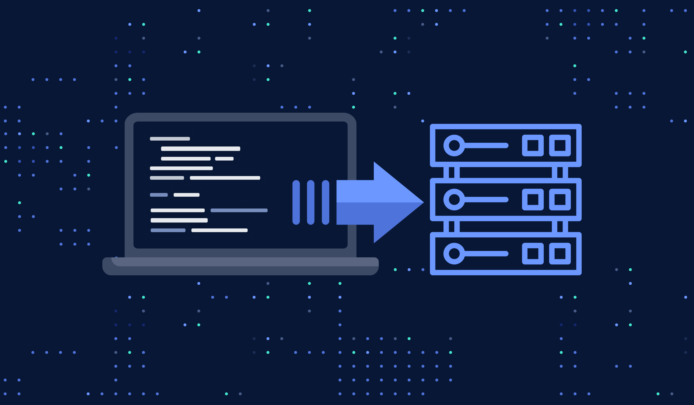
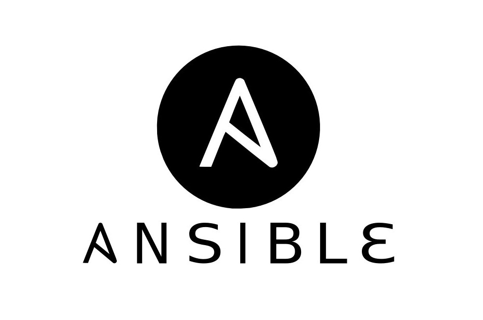
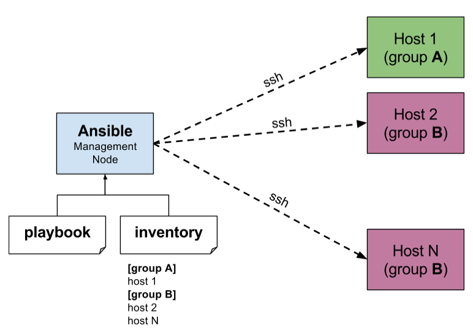

<!-- _class: lead -->
<!-- _paginate: false -->
<!-- _footer: "" -->

# Tema 6
## Infraestructura como Código

MISUM · Universidad de Murcia

---

## Índice

1. Infraestructura como Código (IaC)
2. Infraestructura mutable vs inmutable
3. Enfoques declarativo vs imperativo
4. GitOps
5. Ansible: arquitectura, inventarios y comandos ad hoc
6. Ansible: playbooks, roles y Ansible Galaxy

---

<!-- _class: divider -->

# 1. Infraestructura como Código

---

## ¿Qué es IaC?

> La **Infraestructura como Código (IaC)** utiliza un lenguaje de codificación descriptivo de alto nivel para automatizar el aprovisionamiento de la infraestructura informática.

Elimina la necesidad de aprovisionar y gestionar manualmente servidores, sistemas operativos, conexiones a bases de datos, redes...

<center>



</center>

---

## IaC y DevOps (I)

- **Automatización total del despliegue**: se evitan tareas repetitivas y manuales; la infraestructura se crea con scripts o plantillas.
- **Entornos reproducibles**: desarrollo, pruebas y producción son idénticos porque la configuración está *codificada*.
- **Velocidad y agilidad**: desplegar infraestructura pasa de horas/días a minutos o segundos.
- **Control de versiones**: la infraestructura vive en Git, igual que el código; permite hacer *rollback* si algo falla.

---

## IaC y DevOps (II)

- **Mejor colaboración Dev + Ops**: todo el equipo ve y entiende la infraestructura como parte del producto.
- **Seguridad mejor gestionada**: todo queda documentado y auditable; se pueden escanear los ficheros en busca de malas prácticas antes del despliegue.
- **Costes más bajos**: los entornos se crean y destruyen bajo demanda, consumiendo solo lo necesario.

---

<!-- _class: divider -->

# 2. Infraestructura mutable vs inmutable

---

## Dos formas de gestionar infraestructura

- **Infraestructura mutable**: puede modificarse o actualizarse después de su aprovisionamiento original.
  - *Ejemplo*: entrar por SSH a un servidor Linux de producción, actualizar Apache y reiniciar el servicio.
- **Infraestructura inmutable**: no se modifica una vez aprovisionada; para cambiarla se crea una nueva versión desde cero.
  - *Ejemplo*: para actualizar una app en Docker, se crea una nueva imagen y se lanza un nuevo contenedor.

> **DevOps favorece la infraestructura inmutable**: entornos 100% reproducibles y automatización completa en CI/CD.

---

<!-- _class: divider -->

# 3. Enfoques declarativo vs imperativo

---

## Dos formas de describir la infraestructura

- **Enfoque declarativo**: describe el **estado final deseado**, sin especificar cómo llegar a él.
  - *Ejemplos*: Terraform, manifiestos de Kubernetes, CloudFormation.
- **Enfoque imperativo**: detalla los **pasos y comandos** concretos que hay que ejecutar, en orden, para lograr la configuración deseada.
  - *Ejemplos*: **Ansible**, Chef, Puppet.

> En la práctica se suele combinar: **declarativo** para la infraestructura (redes, VMs, clústeres) e **imperativo** para la configuración interna (paquetes, usuarios, scripts de despliegue). Combo muy usado: **Terraform + Ansible**.

---

<!-- _class: divider -->

# 4. GitOps

---

## ¿Qué es GitOps?

> **GitOps** es una metodología de DevOps que usa **Git como única fuente de verdad** para gestionar y desplegar infraestructura y aplicaciones. Todo cambio se realiza mediante *pull requests* o *commits*.

- Propuesta por Weaveworks en 2017, como evolución natural de IaC.
- Objetivos: auditoría automática, revisión mediante Git y despliegues repetibles e inmutables.

---

## GitOps: ejemplo a alto nivel

Configuración habitual con **dos repositorios**: uno de aplicación (código + Dockerfile + pipeline) y otro de configuración (manifiestos), conectado a un **controlador GitOps**.

1. Un desarrollador cambia código y abre un *Pull Request*.
2. La CI construye una nueva imagen (`app:v2`) y la sube al *registry*.
3. La CI actualiza la versión de la imagen en el repo de configuración (`commit`/`push`).
4. El operador GitOps (Argo CD / Flux) detecta el cambio en Git.
5. Aplica los *manifests* al clúster de Kubernetes → *rollout* automático.
6. El operador verifica continuamente que lo desplegado coincide con lo declarado en Git.

---

<!-- _class: divider -->

# 5. Ansible

---

## ¿Qué es Ansible?

> **Ansible** es una herramienta de automatización y gestión de la configuración que permite gestionar decenas, cientos o miles de sistemas de forma sencilla, desde cualquier lugar.

- Configuración sencilla: solo exige tener **Python** en cada equipo a administrar.
- No requiere agentes instalados en los nodos gestionados (usa SSH).

<center>



</center>

---

## Arquitectura de Ansible

- **Nodo de control**: sistema con Ansible instalado, desde el que se ejecutan los comandos.
- **Nodo gestionado**: sistema administrado por Ansible. Requisitos mínimos: Linux + Python + SSH.

<center>



</center>

---

## Inventarios

El nodo de control tiene acceso a un **inventario** (`hosts.ini`, `inventory.ini`...) donde se definen los hosts que Ansible gestionará, agrupados y con variables asociadas.

```ini
[web]
10.0.0.11
10.0.0.12

[db]
10.0.0.21
```

> En la instalación se crea un inventario global (`/etc/ansible/hosts`), pero lo habitual es tener uno propio dentro del proyecto.

---

## Comandos ad hoc

> Los **comandos ad hoc** son comandos rápidos que se ejecutan sin necesidad de escribir un *playbook*: útiles para tareas puntuales (probar conexión, copiar archivos, reiniciar servicios...).

```bash
ansible <hosts> -i <inventario> -m <módulo> -a "<argumentos>"

ansible all -i inventory -m ping
ansible webservers -m command -a "/sbin/reboot -t now"
```

Un **módulo** es una unidad de acción en Ansible (hay miles): `apt`, `pip`, `copy`, `command`...

---

<!-- _class: divider -->

# 6. Playbooks, roles y Ansible Galaxy

---

## Playbooks

> Un **playbook** es un archivo YAML con el plan completo de automatización: qué hosts gestionar, qué tareas ejecutar y en qué orden.

- Se divide en **plays**; cada *play* se dirige a un conjunto de hosts.
- Cada *play* tiene **tareas**; cada tarea usa un módulo con sus argumentos.
- Se ejecuta con:

```bash
ansible-playbook -i inventario site.yml
```

---

## Ejemplo de playbook

```yaml
---
- name: Actualizar y desplegar webserver
  hosts: web
  become: true
  tasks:
    - name: Instalar/Actualizar Nginx
      apt:
        name: nginx
        state: latest
    - name: Asegurar servicio Nginx iniciado
      service:
        name: nginx
        state: started
        enabled: true
```

`become: true` ejecuta las tareas con privilegios elevados (equivalente a `sudo`).

---

## Roles

> Los **roles** son una forma estructurada y modular de organizar la automatización de Ansible.

```
mi-proyecto/
├─ hosts.ini
├─ site.yml
└─ roles/
   ├─ webserver/tasks/main.yml
   └─ dbserver/tasks/main.yml
```

```yaml
# site.yml
- name: Configurar servidores web
  hosts: web
  become: true
  roles:
    - webserver
```

---

## Ansible Galaxy

- Escribir cada rol desde cero es poco eficiente.
- **Ansible Galaxy** (`galaxy.ansible.com`) es un repositorio de contenido aportado por la comunidad: miles de roles listos para configurar y desplegar aplicaciones comunes.

```bash
ansible-galaxy install geerlingguy.nginx
```

```yaml
- hosts: web
  roles:
    - geerlingguy.nginx
```

---

<!-- _class: lead -->
<!-- _paginate: false -->
<!-- _footer: "" -->

# Resumen

IaC versiona y automatiza la infraestructura igual que el código de la aplicación.
Ansible aprovisiona y configura sistemas de forma declarativa-imperativa, sin agentes.

👉 **Práctica 6: Ansible**
👉 **Proyecto**: integra Git, GitHub, Docker, CI/CD y Ansible
